# Лабораторна робота №4
## Тема: Команди Linux для керування процесами

## **Мета роботи:**
1. Набуття практичних умінь роботи з командною оболонкою Bash.
2. Ознайомлення з основними командами керування процесами.

---

## Матеріальне забезпечення
* ПК типу IBM PC.
* ОС сімейства Windows та віртуальна машина VirtualBox (Oracle).
* ОС GNU/Linux (Ubuntu).
* Сайт мережевої академії Cisco netacad.com та його онлайн-курси з Linux

---

## 1. Відповіді на питання попередньої підготовки

### 1.1 - Команди для моніторингу процесів
Найбільш уживаною є команда `ps`, яка відображає перелік активних процесів, наприклад у форматі `ps aux` або `ps -ef`. Для перегляду процесів у режимі реального часу застосовується команда `top`, яка постійно оновлює інформацію про використання процесора та оперативної пам’яті. Також існує більш зручна інтерактивна версія - `htop`, якщо вона встановлена в системі.
Для відображення ієрархії процесів у вигляді дерева використовується `pstree`, для пошуку процесу за назвою - `pgrep`, а для надсилання сигналів процесам (наприклад, для завершення) використовується команда `kill`.

### 1.2 - Команда `ps` не відображає стан процесів у реальному часі
Вона показує знімок (snapshot) стану процесів на момент виконання команди. Для моніторингу процесів у реальному часі використовують `top` або `htop`, які регулярно оновлюють дані на екрані через визначені проміжки часу.

### 1.3 - Сортування процесів у команді `top`
За замовчуванням `top` впорядковує процеси за відсотком використання CPU.

Перемикання між параметрами сортування здійснюється під час роботи програми натисканням відповідних клавіш:

* `P` - сортування за використанням CPU;
* `M` - за використанням пам’яті;
* `N` - за PID;
* `T` - за часом роботи процесу.

Також можна натиснути `f`, щоб перейти в меню керування полями, де можна вибрати інший стовпець для сортування, а клавіша `R` дозволяє змінити порядок сортування (за зростанням або спаданням).

### 1.4 - Команди завершення процесів

* `kill` - надсилання сигналу процесу за його PID (наприклад, kill 1234, за замовчуванням надсилається SIGTERM).
* `kill -9` - примусове завершення процесу сигналом SIGKILL (наприклад, kill -9 1234).
* `killall` - завершення всіх процесів із зазначеним ім’ям (наприклад, killall firefox).
* `pkill` - завершення процесів за іменем або шаблоном (наприклад, pkill chrome).

---

## 2. Відповіді на питання

### 2.1 - Виведення вмісту каталогу `/proc` командою `ls`.


Каталог `/proc` розташований у кореневому розділі файлової системи. 
Це віртуальна файлова система, яка створюється ядром Linux під час роботи системи. Вона не зберігається фізично на диску.

#### Призначення:
* Отримання інформації про процеси.
* Отримання системних відомостей.
* Перегляд параметрів ядра.

#### Особливості вмісту:
* Каталоги з числовими назвами (наприклад `/proc/1234`) - це процеси (PID).
* /proc/version - версія ядра
* /proc/uptime - час безперервної роботи системи

Перегляд текстових файлів здійснюється командою `cat`
```Bash
cat /proc/version
```
### 2.2 - Виведення інформації про активні сеанси користувачів командами `who` та `w`.

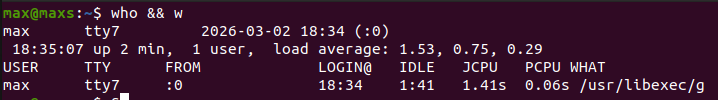


`who` - відображає користувачів, які увійшли в систему.  

`w` - показує активних користувачів і їхні поточні дії.

### 2.3 - Комбінації клавіш у терміналі

| Комбінація | Дія |
| :--- | :--- |
| `Ctrl + C` | Завершення поточного процесу |
| `Ctrl + D` | Вихід з оболонки / передача EOF |
| `Ctrl + Z` | Призупинення процесу (переведення в background suspended) |

### 2.4 - Відмінність фонового процесу від звичайного

| Звичайний (foreground) | Фоновий (background) | Використання |
| :--- | :--- | :--- |
| Виконується у поточному терміналі | Працює без блокування терміналу | Запуск тривалих задач |
| Блокує введення команд | Дозволяє вводити інші команди | Серверні служби |

### 2.5 - Команди `jobs`, `bg`, `fg`

| `jobs` | `bg` | `fg` |
| :--- | :--- | :--- |
| Відображає список фонових або призупинених задач поточної оболонки | Відновлює призупинений процес у фоновому режимі | Переміщує процес на передній план |

### 2.6 - Перегляд усіх фонових процесів командою `top`

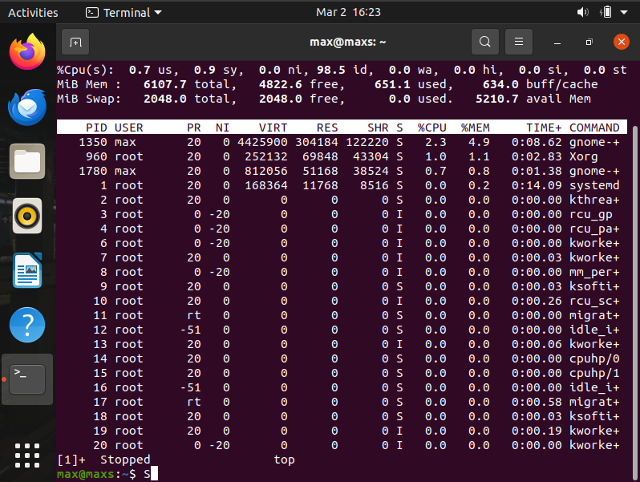


### 2.7 - Призупинення, відновлення та повторний запуск фонового процесу

#### Призупинити:
Якщо в foreground -> `Ctrl + Z`

#### Відновити:
У foreground -> `fg`  
У background -> `bg`

#### Повторний запуск:
Якщо процес завершений - виконати команду повторно.

---

## 3. Виконані команди в терміналі

### 3.1 - Запуск `top`

#### Відображає:
* PID
* USER
* %CPU
* %MEM
* TIME
* COMMAND

Найбільш активними є процеси з найбільшим значенням %CPU.

### 3.2 - Призупинення `top`
Використовується комбінація `Ctrl + Z`.


### 3.3 - Виведення `ps`
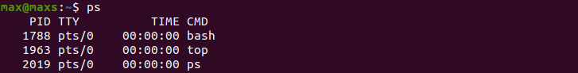


### 3.4 - 5 прикладів використання `ps`:
* `ps -e` - Показує всі процеси системи.
  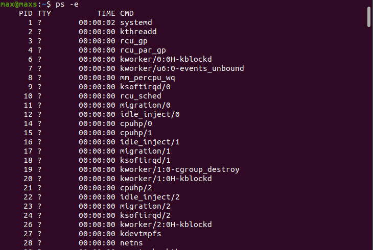
* `ps -ef` - Показує всі процеси з детальною інформацією.
  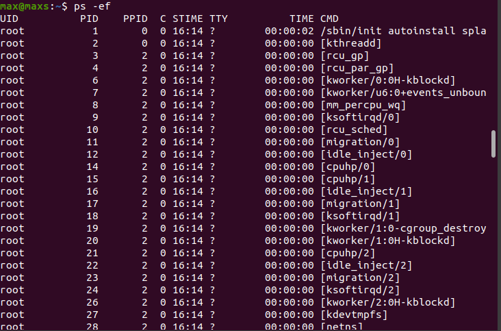
* `ps -u username` - Показує процеси конкретного користувача.
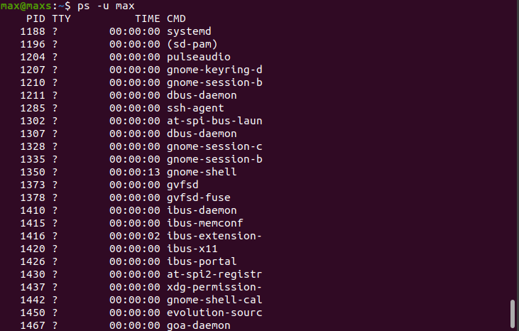
* `ps -l` - Відображає процеси у довгому форматі.
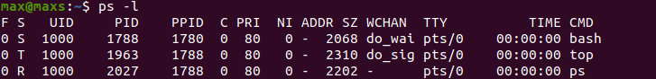
* `ps -H` - Відображає дерево процесів.
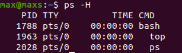

### 3.5 - Перевірка фонових процесів за допомогою `jobs`
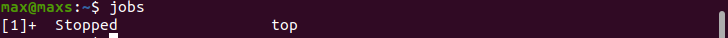


### 3.6 - Відновлення `top` у foreground, призупинення та запуск у background
Використовується команда `fg`
Потім комбінація `Ctrl + Z`
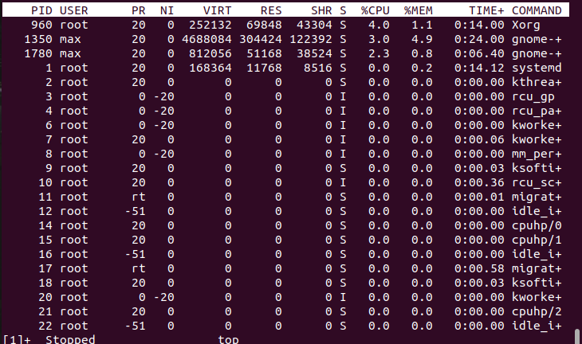

Далі команда `bg`


### 3.7 - Завершення фонового процесу
Використовується команда `kill %1` 

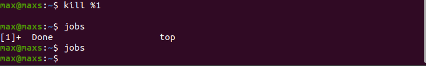

## Відповіді на контрольні запитання

1. The `/proc` directory in Linux is a virtual file system created and managed by the kernel. It does not store real files on disk. Instead, it provides real-time access to system and kernel information. It contains data about running processes (each process has its own directory named by its PID), memory usage statistics, CPU information, kernel version, system uptime, mounted devices, and other runtime parameters. It is mainly used for system monitoring, diagnostics, and kernel configuration.

2. You can use the top command to monitor processes in real time. It shows memory usage in the %MEM column. By locating the three specific processes (by name or PID) and comparing their %MEM values, you can determine which one uses the most memory.

3. The process hierarchy can be viewed using `pstree` or the command `ps -ejH`. In Linux, processes are organized in a tree structure. At the top is usually `systemd` (PID 1). Every process has a parent process identified by its PPID. This structure reflects how processes are spawned. For instance, `systemd` may start a login service, which launches a shell like bash, and that shell can start other applications such as top. This parent–child relationship forms the process tree.

4. The `top` command provides a continuously updating, interactive view of running processes. It allows real-time monitoring and sorting while it is running.
The `ps` command provides a static snapshot of processes at the exact moment the command is executed. It is not interactive and requires specific options to filter or format output.
In short, `top` is dynamic monitoring, while `ps` is a one-time listing.

5. Compared to `top`, `htop` delivers a more intuitive and feature-rich interface. It supports colored output, easier navigation, mouse interaction, scrolling, and a tree-style process display. It also simplifies selecting and terminating processes through function keys.

6. On devices running Android, process monitoring tools typically include the built-in task manager, the “Running Services” section in Developer Options, memory statistics, and battery usage analysis. These features allow users to check active apps, review RAM usage, stop applications, and analyze resource consumption.

7. Android also allows terminal-based process management through ADB (Android Debug Bridge) or terminal emulator apps. Using ADB, users can access the device shell and run commands like `ps`, `top`, or `kill`. More advanced control usually requires root privileges. Unlike Android, iOS does not normally permit terminal-based process management unless the device is jailbroken.

8. Yes, on Android devices it is possible to install third-party applications such as advanced task managers, system monitoring tools, and terminal emulators. These applications provide detailed information about CPU usage, RAM consumption, and background processes. Some advanced features may require root access for full functionality.

## Conclusion (Висновок)
In this laboratory assignment, the fundamentals of process management in the Linux operating system were examined and evaluated. The structure and role of the `/proc` virtual file system were analyzed, with attention given to the system and process data it makes available. The methods for checking active user sessions were also reviewed using commands such as `who` and `w`.

Hands-on experience in process control was gained by using terminal key combinations like Ctrl + C, Ctrl + D, and Ctrl + Z, along with commands including `jobs`, `bg`, `fg`, `ps`, and `top`. The distinction between foreground and background processes was clarified, and their practical usage was discussed.

In the practical section, the `top` utility was applied to observe system performance and determine which processes consumed the most resources. Tasks such as suspending, resuming (both in foreground and background), and terminating processes were carried out successfully.

## Team Contributions
- **Member 1 ([Shanson777])**: Added a comprehensive guide on Linux commands for process management, including objectives, materials, and practical exercises.
- **Member 2 ([Pisk08])**:  Updated the content of the laboratory work document to include detailed explanations of Linux commands for process management, team contributions, and additional sections on terminal commands and process handling.
- **Member 3 ([Vangus387474])**:  Answered the control questions and did conclusion. 


