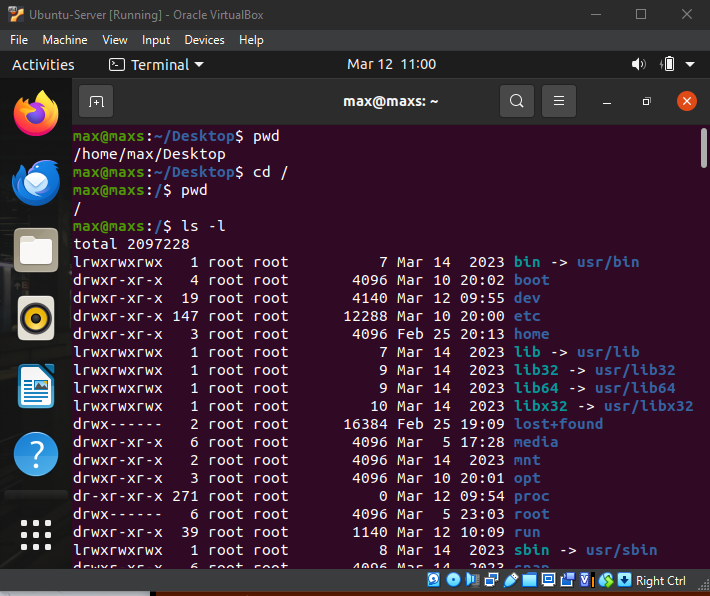
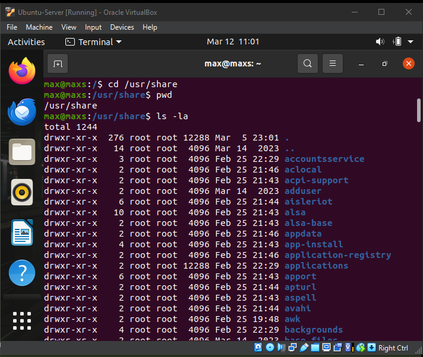
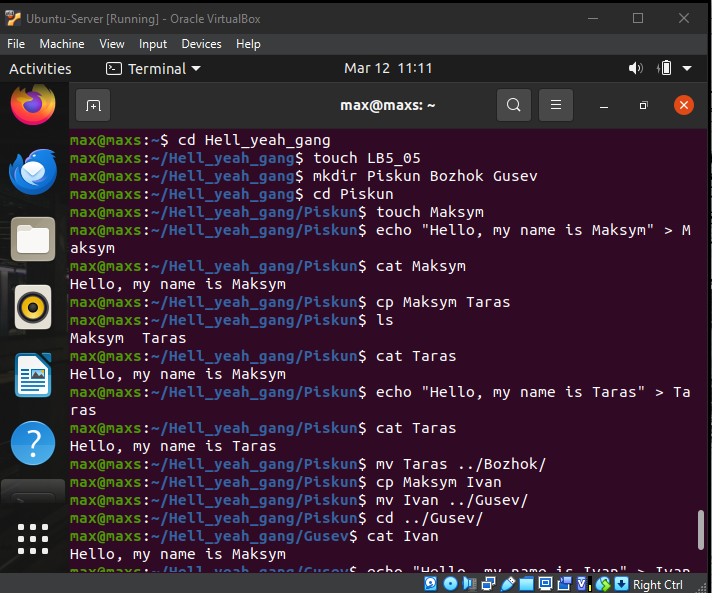
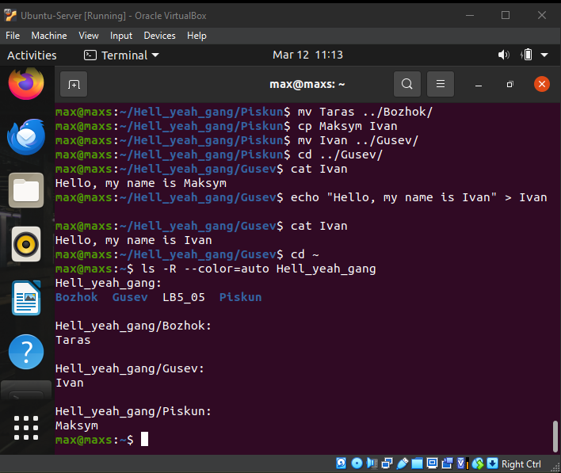
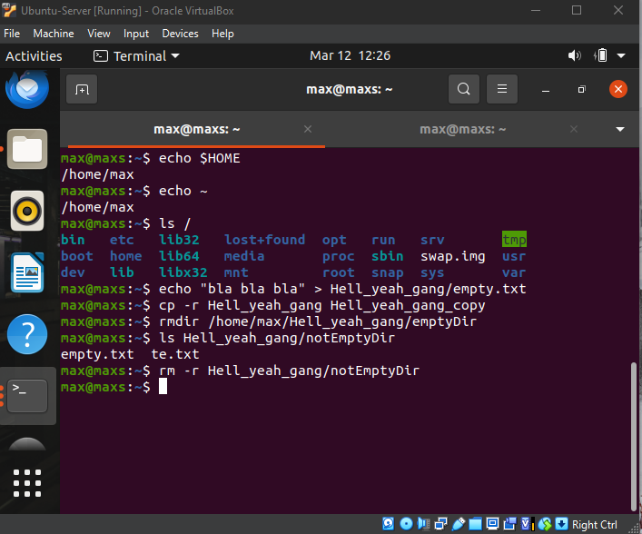

# Лабораторна робота №5
## Тема: “Знайомство з командами навігації по файловій системі та керування файлами та каталогами”

## **Мета роботи:**
1. Отримання практичних навиків роботи з командною оболонкою Bash.
2. Знайомство з базовими командами навігації по файловій системі.
3. Знайомство з базовими командами для керування файлами та каталогами.

---
# 1. Словник базових англійських термінів

| Термін | Переклад | Пояснення |
|------|------|------|
| File | Файл | Одиниця збереження даних у файловій системі |
| Directory | Каталог | Папка, що містить файли або інші каталоги |
| Path | Шлях | Адреса розташування файлу або каталогу |
| Root | Кореневий каталог | Найвищий каталог у файловій системі Linux (`/`) |
| Home directory | Домашній каталог | Каталог користувача |
| Command | Команда | Інструкція, яку користувач вводить у терміналі |
| Parameter / Option | Параметр | Додаткова опція команди |
| Terminal | Термінал | Інтерфейс для роботи з командним рядком |
| Copy | Копіювання | Створення копії файлу |
| Move | Переміщення | Перенесення файлу або каталогу |
| Delete | Видалення | Видалення файлу або каталогу |
| List | Список | Виведення списку файлів |
| Filesystem | Файлова система | Спосіб організації зберігання файлів |
| Absolute path | Абсолютний шлях | Повний шлях від кореневого каталогу |
| Relative path | Відносний шлях | Шлях від поточного каталогу |

---

# 2. Відповіді на питання попередньої підготовки:

## 2.1 Порівняння файлових структур Windows та Linux

| Характеристика | Windows | Linux |
|---|---|---|
| Корінь файлової системи | Кілька дисків (C:\, D:\) | Один кореневий каталог `/` |
| Розділення файлів | За літерами дисків | Єдина ієрархічна структура |
| Системні каталоги | `Windows`, `Program Files` | `/bin`, `/etc`, `/usr`, `/home` |
| Розширення файлів | Часто визначає тип файлу (.exe, .txt) | Не обов'язкове |
| Регістр символів | Не чутливий до регістру | Чутливий до регістру |
| Робота через GUI | Основний спосіб | Часто використовується термінал |

### Висновок

У Windows структура файлової системи прив'язана до **логічних дисків**, тоді як у Linux використовується **єдина ієрархічна структура каталогів**, яка починається з кореневого каталогу `/`.

---

## 2.2 Поняття FHS

**FHS (Filesystem Hierarchy Standard)** — це стандарт, який визначає структуру каталогів у Linux та правила їх використання.

Метою FHS є:
- уніфікація структури файлової системи
- забезпечення сумісності між різними дистрибутивами Linux
- стандартизація розміщення системних файлів

### Основні каталоги згідно FHS

| Каталог | Призначення |
|---|---|
| `/` | Кореневий каталог |
| `/bin` | Основні системні команди |
| `/boot` | Файли завантаження системи |
| `/etc` | Конфігураційні файли |
| `/home` | Домашні каталоги користувачів |
| `/usr` | Програми та бібліотеки |
| `/var` | Змінні дані (логи, кеш) |
| `/tmp` | Тимчасові файли |
| `/dev` | Пристрої системи |
| `/lib` | Системні бібліотеки |

### Використання FHS

Стандарт FHS допомагає:
- підтримувати однакову структуру Linux систем
- полегшувати адміністрування
- забезпечувати передбачуване розташування файлів.

---

## 2.3 Основні команди роботи з файлами та каталогами в Linux

### Створення файлів і каталогів

| Команда | Призначення | Приклад |
|---|---|---|
| `touch` | створення файлу | `touch file.txt` |
| `mkdir` | створення каталогу | `mkdir folder` |

---

### Копіювання

| Команда | Призначення | Приклад |
|---|---|---|
| `cp` | копіювання файлів | `cp file.txt copy.txt` |
| `cp -r` | копіювання каталогу | `cp -r folder backup` |

---

### Переміщення

| Команда | Призначення | Приклад |
|---|---|---|
| `mv` | переміщення або перейменування | `mv file.txt newfile.txt` |

---

### Видалення

| Команда | Призначення | Приклад |
|---|---|---|
| `rm` | видалення файлу | `rm file.txt` |
| `rm -r` | видалення каталогу | `rm -r folder` |
| `rmdir` | видалення порожнього каталогу | `rmdir folder` |

---

### Перегляд файлів

| Команда | Призначення | Приклад |
|---|---|---|
| `ls` | список файлів | `ls` |
| `ls -l` | детальна інформація | `ls -l` |
| `cat` | перегляд файлу | `cat file.txt` |

<h1 align="center"> ЧОРТ ЗАБИРАЙ! </h1>

  

# 2. Опрацюйте всі приклади команд, що представлені у лабораторних роботах курсу NDG Linux Essentials - Lab 7: Navigating the Filesystem та Lab 8: Managing Files and Directories. Створіть таблицю для опису цих команд

# 3. Робота в в терміналі (закріплення практичних навичок) обов'язково представити свої скріншоти:
**1-2. Визначення поточного каталогу та перехід до кореневого каталогу:**
`pwd`, `cd /`, `pwd`

**3. Перегляд вмісту поточного каталогу у довгому форматі:**
`ls -l`

**4-5. Робота з каталогом /usr/share (перехід та перегляд прихованих файлів):**
`cd /usr/share`, `pwd`, `ls -la`

**6-9. Робота з каталогом /etc (глоб-шаблони):**
Перехід: `cd /etc`
Файли на мою літеру: `ls -d [Mm]*`
Файли з 6 літер: `ls -d ??????`
 Maksym`, `cat Maksym`

**18-23. Копіювання, редагування та переміщення файлу (Taras):**
`cp Maksym Taras`, `ls`, `cat Taras`
`echo "Hello, my name is Taras" > Taras`, `cat Taras`
`mv Taras ../Bozhok/`

**24-29. Копіювання, переміщення та редагування файлу (Ivan):**
`cp Maksym Ivan`
`mv Ivan ../Gusev/`
`cd ../Gusev/`, `cat Ivan`
`echo "Hello, my name is Ivan" > Ivan`, `cat Ivan`

**30-31. Перегляд вмісту створеної структури рекурсивно:**
`cd ~`
`ls -R --color=auto Hell_yeah_gang`
> **Примітка:** [> **Примітка:** У моїй системі команда `ls` має встановлений аліас на `ls --color=auto`, проте я використовую повну форму команди, оскільки в завданні наголошено на кольоровому відображенні результатів. Це для того, щоб точно виконати умову завдання і показати, що я знаю, яка саме команда за це відповідає.]

---

## Control Questions

**1. How can you view the path to the user's home directory using the `echo` command?**
There are 2 ways:
* Accessing the system variable: `echo $HOME`
* Using the tilde symbol: `echo ~`

**2. Is it possible to view the contents of the root directory while in the user's home directory without navigating to the root directory?**
Yes, by using the command with an absolute path:
`ls /`

**3. How can you add information to an empty file in the terminal?**
The fastest way is to use the output redirection of the `echo` command:
`echo "Your text" > filename.txt`

**4. How do you copy and delete an existing directory? Will there be a difference in the commands if the directory is not empty?**
* **Copying:** The command `cp -r dir1 dir2` (the `-r` flag is used for recursive copying of all contents).
* **Deleting:** * If the directory is **empty**, you can use `rmdir dirname`.
  * If the directory is **not empty**, you must use `rm -r dirname` (recursive deletion).

**5. In which of the following examples does the file get moved? Renamed? Both actions simultaneously?**
* `mv /work/tech/comp.png /Desktop` — **Moving** (if /Desktop is a directory, the file will simply be moved there while keeping its name).
* `mv /work/tech/comp.png /work/tech/my_car.png` — **Renaming** (the path remains the same, only the filename changes).
* `mv /work/tech/comp.png /Desktop/computer.png` — **Both actions simultaneously** (the file is moved to another directory and gets a new name at the same time).

## Team Contributions
- **Member 1 ([Shanson777])**: Registered almost full report, created sheet of terms
- **Member 2 ([Pisk08])**:  Did technical part of work and took screenshots
- **Member 3 ([Vangus387474])**:  Did 2 task "Work through all the command examples presented" and did sheet

