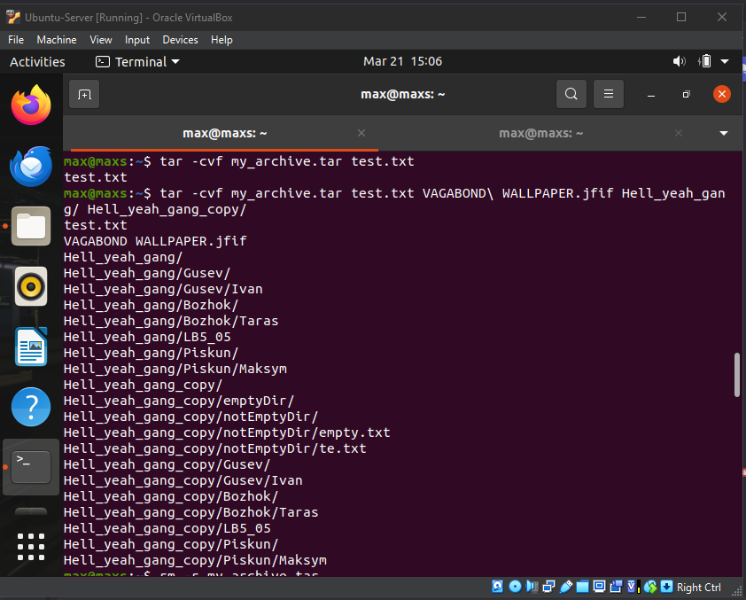
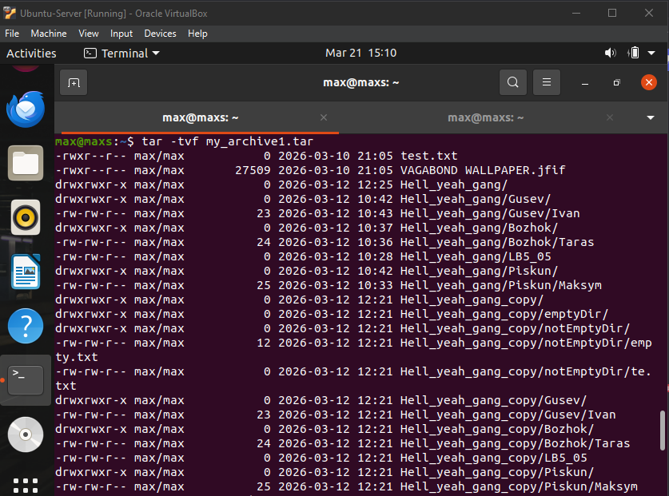
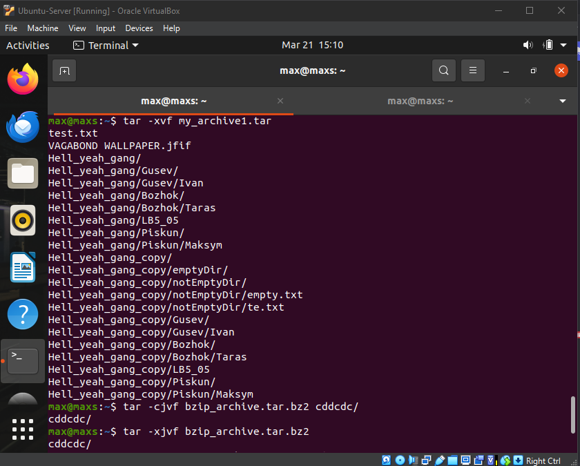
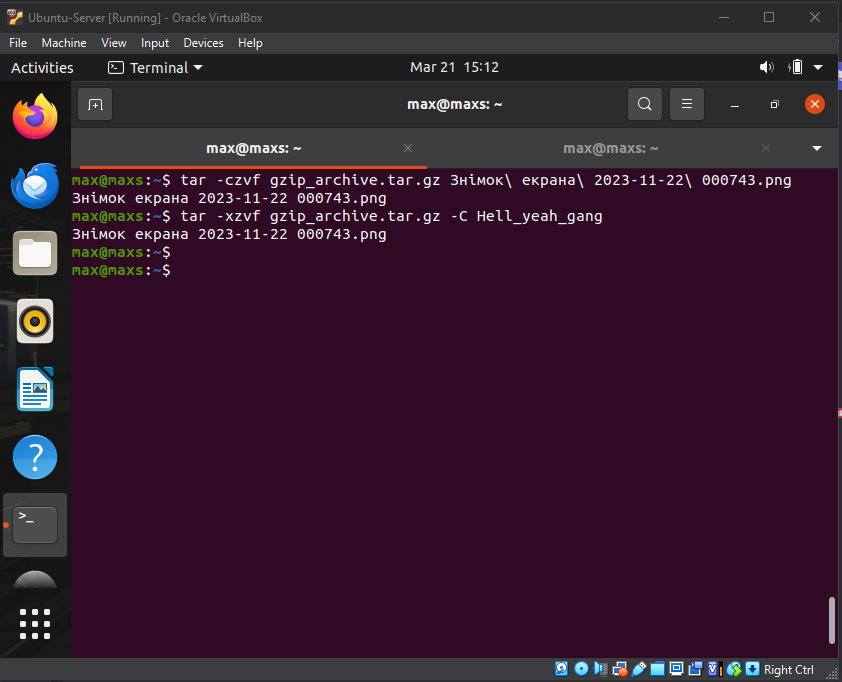

# Лабораторна робота №6
## Тема: Команди Linux для архівування та стиснення даних. Робота з текстом

## **Мета роботи:**
1. Отримання практичних навиків роботи з командною оболонкою Bash.
2. Знайомство з базовими командами для архівування та стиснення даних.
3. Знайомство з базовими діями при роботі з текстом у терміналі.

---


## 1. Завдання для попередньої підготовки

### 1.1 — Словник (Dictionary)

| Term | Explanation |
| :--- | :--- |
| Compression | Зменшення розміру файлу |
| Archiving | Об’єднання кількох файлів в один |
| Lossless | Стиснення без втрати даних |
| Lossy | Стиснення з частковою втратою |
| Archive | Файл, що містить інші файли |
| Pipe | Передача даних між командами |
| stdin | Вхідні дані |
| stdout | Вивід |
| stderr | Помилки |
| Filter | Обробка тексту |

### 1.2 — Відповіді на питання

#### 1.2.1 — Призначення команд `tar`, `xz`, `zip`, `bzip`, `gzip`

- `tar` — використовується для архівування файлів і каталогів у один файл (архів). Сам по собі tar не стискає дані, але часто використовується разом із програмами стиснення (gzip, bzip2, xz)

- `xz` — утиліта для стиснення файлів з високим рівнем компресії. Зазвичай використовується для створення архівів із розширенням `.xz`

- `zip` — програма для одночасного архівування і стиснення файлів у форматі `.zip`. Поширена у Windows і Linux

- `bzip` / `bzip2` — програма для стиснення файлів, яка забезпечує кращий коефіцієнт стиснення, ніж gzip, але працює повільніше. Архіви мають розширення `.bz2`

- `gzip` — популярна утиліта для швидкого стиснення файлів у Linux. Створює файли з розширенням `.gz`

#### 1.2.2 — Приклади архівування та стиснення

- Архівування каталогу:

```Bash
tar -cvf archive.tar folder/
```

- Архівування та стиснення за допомогою gzip:

```Bash
tar -czvf archive.tar.gz folder/
```

- Архівування та стиснення за допомогою bzip2:

```Bash
tar -cjvf archive.tar.bz2 folder/
```

- Стиснення файлу gzip:

```Bash
gzip file.txt
```

- Створення zip-архіву:

```Bash
zip archive.zip file1.txt file2.txt
```

#### 1.2.3 — Призначення команд `cat`, `less`, `more`, `head`, `tail`

- `cat` — виводить вміст файлу в термінал або об’єднує кілька файлів.

- `less` — переглядач файлів, що дозволяє зручно прокручувати текст вперед і назад.

- `more` — переглядач файлів, який показує текст посторінково, але має менше функцій, ніж less.

- `head` — показує перші рядки файлу (за замовчуванням 10).

- `tail` — показує останні рядки файлу та може відслідковувати їх зміну в реальному часі (`tail -f`).

#### 1.2.4 — Принципи роботи каналів, потоків і фільтрів

У Linux програми можуть обмінюватися даними через потоки (streams) — стандартний ввід (stdin), стандартний вивід (stdout) і стандартний потік помилок (stderr).

Канал (pipe) — механізм, який дозволяє передавати результат виконання однієї команди безпосередньо як вхідні дані для іншої команди. Для цього використовується символ |.

Приклад:

```Bash
cat file.txt | grep "word"
```

Тут результат команди `cat` передається команді `grep`.

Фільтри — це команди, які читають дані зі стандартного вводу, обробляють їх і передають результат у стандартний вивід. До фільтрів належать `grep`, `sort`, `head`, `tail`, `wc` та інші.

#### 1.2.5 — Призначення команди `grep`

`grep` — це команда для пошуку тексту у файлах або потоці даних за заданим шаблоном (рядком або регулярним виразом).

Приклади використання:

Пошук слова у файлі:

```Bash
grep "error" logfile.txt
```

Пошук у декількох файлах:

```Bash
grep "hello" *.txt
```

Пошук без урахування регістру:

```Bash
grep -i "linux" file.txt
```

Виведення номерів рядків:

```Bash
grep -n "word" file.txt
```

---

## 2. Хід роботи 

### 2.1 — Приклади команд з NDG Lab 9 & 10

| Назва команди | Просте пояснення |
| :--- | :--- |
| `mkdir mybackups` | Створює папку `mybackups` у домашній директорії |
| `tar -cvf mybackups/udev.tar /etc/udev` | Створює архів `udev.tar` з вмістом папки `/etc/udev` |
| `tar` | Команда для створення, перегляду, розпакування та оновлення архівів |
| `gzip` | Стискає файл і створює файл з розширенням `.gz` |
| `gunzip` | Розпаковує файли `.gz` |
| `bzip2` | Стискає файл сильніше, ніж gzip (але повільніше) |
| `bunzip2` | Розпаковує файли `.bz2` |
| `xz` | Сильно стискає файли (краще за gzip і bzip2, але повільніше) |
| `unxz` | Розпаковує файли `.xz` |
| `zip` | Створює zip-архів з файлів і папок |
| `unzip` | Розпаковує zip-архів |
| `echo` | Виводить текст у термінал |
| `cat` | Показує вміст файлу або об’єднує файли |
| `find` | Шукає файли або папки за різними параметрами |
| `tr` | Замінює або видаляє символи в тексті |
| `ls -l` | Показує детальну інформацію про файли |
| `cut -d: -f1` | Виводить першу частину рядка до символу `:` |
| `head` | Показує перші рядки файлу |
| `tail` | Показує останні рядки файлу |
| `grep` | Шукає текст у файлах |
| `egrep` | Шукає текст із складнішими шаблонами |

## 2.2 Практика з командою tar
Створити файл з розширенням .tar  
```
tar -cvf my_archive.tar file
```
 Створити файл з розширенням .tar, що складається з декількох файлів і каталогів одночасно 
```
tar -cvf my_archive1.tar file1 file2 dir1/ dir2/
```

Переглянути вміст файлу
```
tar -tvf my_archive1.tar
```

Витягти вміст файлу 
```
tar `tar -xvf my_archive1.tar
```
Створити архівний файл tar, стиснений за допомогою bzip2  
```
tar -cjvf bzip_archive.tar.bz2 file
```
Витягти вміст файлу tar bzip2
``` 
tar -xjvf bzip_archive.tar.bz2
```

Створити архівний tar файл, стиснений за допомогою gzip
``` 
tar -czvf gzip_archive.tar.gz dir1/
```
Витягти вміст файлу tar gzip
```
 tar -xzvf gzip_archive.tar.gz
```


### 2.3 — Перенаправлення потоків виведення в bash

| Команда | Що виконує команда? |
| :--- | :--- |
| `cmd 1> file` | Перенаправляє стандартний потік виведення (`stdout`) у файл |
| `cmd > file` | Те саме що `1>` — запис stdout у файл |
| `cmd 2> file` | Перенаправляє потік помилок (stderr) у файл |
| `cmd >> file` | Додає `stdout` у кінець файлу |
| `cmd &> file` | Перенаправляє `stdout` і `stderr` у файл |
| `cmd > file 2>&1` | Записує `stdout` і `stderr` у один файл |
| `cmd >> file 2>&1` | Додає `stdout` і `stderr` у кінець файлу |
| `cmd 2>&1 > /dev/null` | `stderr` направляється у `stdout`, `stdout` відправляється у `/dev/null` |
| `cmd 2> /dev/null` | Приховує повідомлення про помилки |
| `cmd1  cmd2` | Результат cmd1 передається як вхід для cmd2 |
| `cmd1 2>&1 cmd2` | `stdout` і `stderr` cmd1 передаються у cmd2 |

### 2.4 — Приклад команд та їх дії

| Команда (контейнер команд) | Що виконує команда? | Який потік перенаправлення? |
| :--- | :--- | :--- |
| `echo "It is a new story." > story` | Записує текст у файл story (створює або перезаписує) | stdout -> файл |
| `date > date.txt` | Записує поточну дату у файл `date.txt` | stdout -> файл |
| `cat file1 file2 file3 > bigfile` | Об’єднує файли і записує результат у `bigfile` | stdout -> файл |
| `ls -l >> directory` | Додає результат команди до файлу `directory` | stdout -> файл (append) |
| `sort < file1_unsorted > file2_sorted` | Сортує вміст файлу і записує у новий файл | stdin <- файл, stdout -> файл |
| `find -name '*.txt' > file.txt 2> /dev/null` | Шукає `.txt` файли, результат записує у файл, помилки приховує | stdout -> файл, stderr -> /dev/null |
| `cat file1_unsorted  sort > file2_sorted` | Передає вміст файлу через `pipe` до команди сортування | pipe + stdout -> файл |
| `cat myfile  grep student  wc -l` | Підраховує кількість рядків, що містять слово `student` | pipe між командами |

---

## 3. Відповіді на контрольні запитання

### 3.1 Порівняльна характеристика процесів стискання та архівування

Стискання (compression) — це процес зменшення розміру файлу за допомогою спеціальних алгоритмів. Мета стискання — економія дискового простору та зменшення обсягу даних для передачі по мережі.

Архівування (archiving) — це процес об’єднання кількох файлів і каталогів у один файл-архів для зручності зберігання або передачі.

| Характеристика | Стискання | Архівування |
| :--- | :--- | :--- |
| Основна мета | Зменшення розміру файлу | Об'єднання файлів |
| Результат | Стиснений файл | Архів |
| Збереження структури каталогів | Не завжди | Так |
| Приклади | `gzip`, `bzip2`, `xz` | `tar` |

Часто ці два процеси використовуються разом, наприклад `tar` + `gzip`, щоб створити архів і одночасно його стиснути.

### 3.2 Інші програми для стискання та архівування в Linux

Окрім розглянутих у роботі команд, в Linux існує багато інших програм.

#### Приклади:

- 7-Zip (7z) — Сучасний архіватор з дуже високим рівнем стискання. Має підтримку багатьох форматів, працює з великими файлами.

```Bash
7z a archive.7z folder
```

- rar / unrar — Популярний формат архівів. Має високу ефективність стискання та підтримку відновновлення пошкоджених архівів.

- lzma — Алгоритм стискання з високим коефіцієнтом стиснення.

- ar — Використовується для створення архівів бібліотек у Linux.

### 3.3. Порівняння алгоритмів стискання

| Алгоритм | Використання | Особливості |
| :--- | :--- | :--- |
| DEFLATE | gzip | Швидке стискання |
| Burrows-Wheeler | bzip2 | Краще стискає, але повільніше |
| LZMA2 | xz | Дуже високий рівень стискання |

| Алгоритм | Швидкість | Ступінь стискання |
| :--- | :--- | :--- |
| gzip | Найшвидший | Середній |
| bzip2 | Середній | Кращий |
| xz | Повільний | Найефективніший |

### 3.4. Програмні засоби для архівування на мобільному телефоні на базі Android

#### ZArchiver

Мобільний архіватор для Android.

Можливості:
- створення та розпакування архівів
- підтримка форматів  `zip`, `rar`, `7z`, `tar`, `gzip`
- робота з паролями

#### RAR

Офіційна мобільна версія WinRAR.

Особливості:
- підтримка `rar` і `zip`
- відновлення архівів
- тестування файлів

#### WinZip Mobile

Мобільний архіватор для Android та iOS.

Функції:
- робота з `zip`
- інтеграція з хмарними сервісами

### 3.5. Програмні засоби для архівування у Windows

#### Windows має вбудовану підтримку ZIP архівів.

Функції:
- створення `zip` архівів
- розпакування файлів
- інтеграція з файловим менеджером.

#### WinRAR

Один із найпопулярніших архіваторів.

Особливості:
- підтримка `rar` і `zip`
- високий рівень стискання
- захист архівів паролем.

#### 7-Zip (7z)

Безкоштовний архіватор з відкритим кодом.

Переваги:
- високий коефіцієнт стискання
- підтримка багатьох форматів
- безкоштовне використання.

### 3.6. Використання архівування та стискання для резервування даних

#### Архівування та стискання широко використовуються для резервного копіювання (backup).

Основні переваги:
- зменшення розміру резервних копій
- збереження структури каталогів
- зручність передачі та зберігання даних
- можливість швидкого відновлення системи.

#### Використання у системному адмініструванні

Архівування використовується для:
- створення резервних копій серверів
- перенесення файлів між системами
- архівування логів
- зберігання конфігураційних файлів
- розповсюдження програмного забезпечення.

### 3.7. Призначення файлу `/dev/null`

`/dev/null` — це спеціальний файл у Linux, який називається "null device".

Його призначення — приймати будь-які дані та одразу їх відкидати.

Тобто вся інформація, яка перенаправляється у цей файл, не зберігається і не відображається.

#### Приклад використання

Приховування помилок:

```Bash
command 2> /dev/null
```
Приховування всього виводу:
```Bash
command > /dev/null 2>&1
```
Це часто використовується у скриптах, коли потрібно ігнорувати непотрібний вивід або помилки.

---

## Висновок (Conclusion)
During this laboratory work, practical experience in using the Bash command-line interface in the Linux operating system was gained. The main tools for archiving and compressing data, including tar, gzip, bzip2, and xz, were explored. 

Their functions, key options, and real usage for creating, viewing, and extracting archives were examined.

The work also covered text processing utilities such as cat, less, more, head, tail, and grep, which are commonly used for viewing, searching, and handling text files in Linux.

Particular focus was given to input/output streams, redirection, pipes, and filters in Bash. These features make it possible to combine commands and process data efficiently within the terminal.

  


## Team Contributions
- **Member 1 ([Shanson777])**: Registered almost full report, created sheet of terms
- **Member 2 ([Pisk08])**:  Did technical part of work and took screenshots
- **Member 3 ([Vangus387474])**:  Did 2 task "Приклади команд з NDG Lab 9 & 10", did sheet and conclusion
