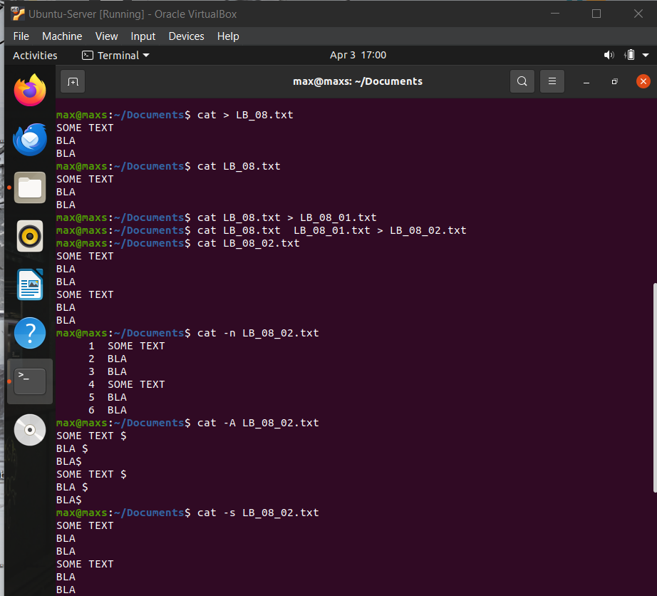
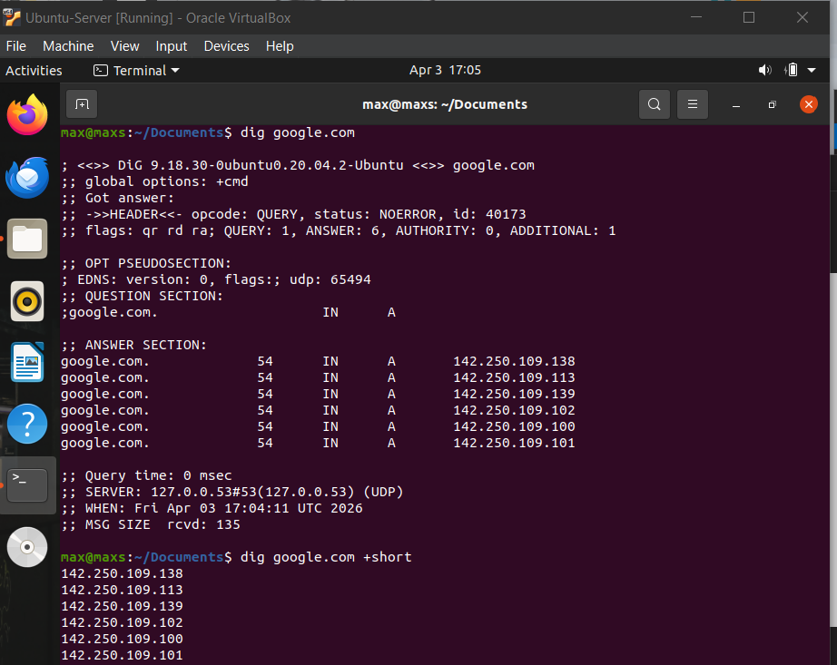
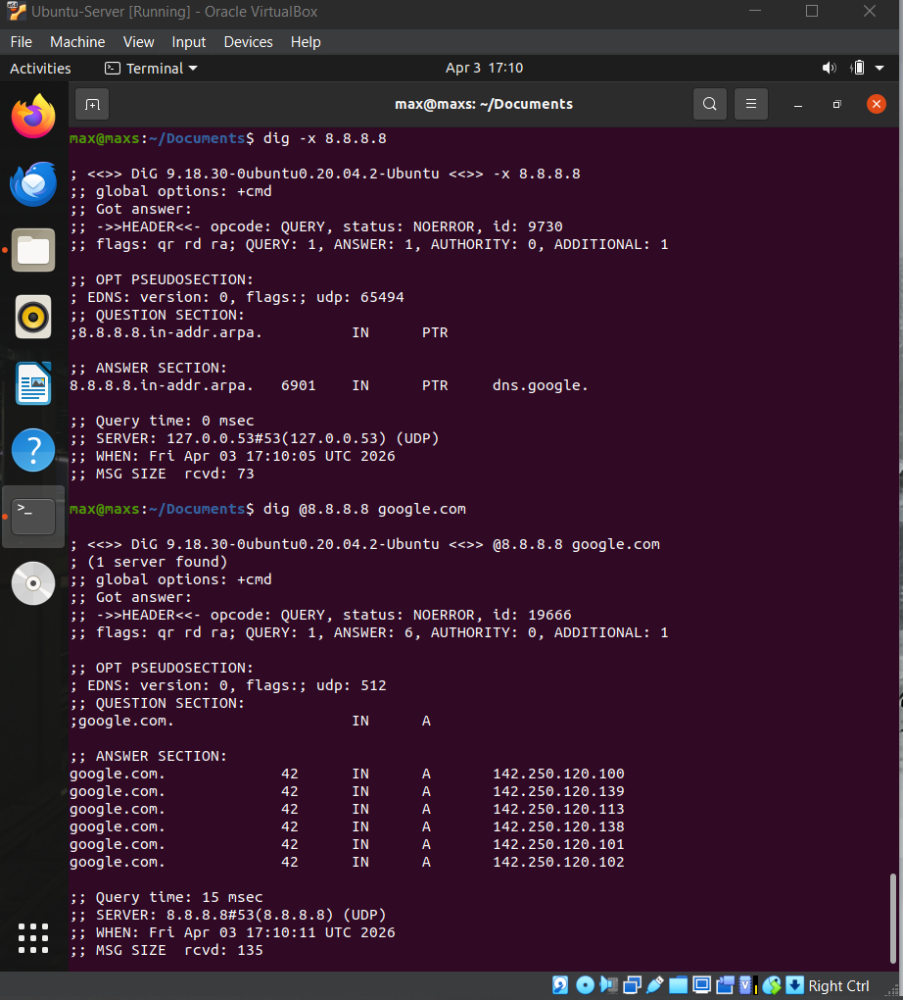
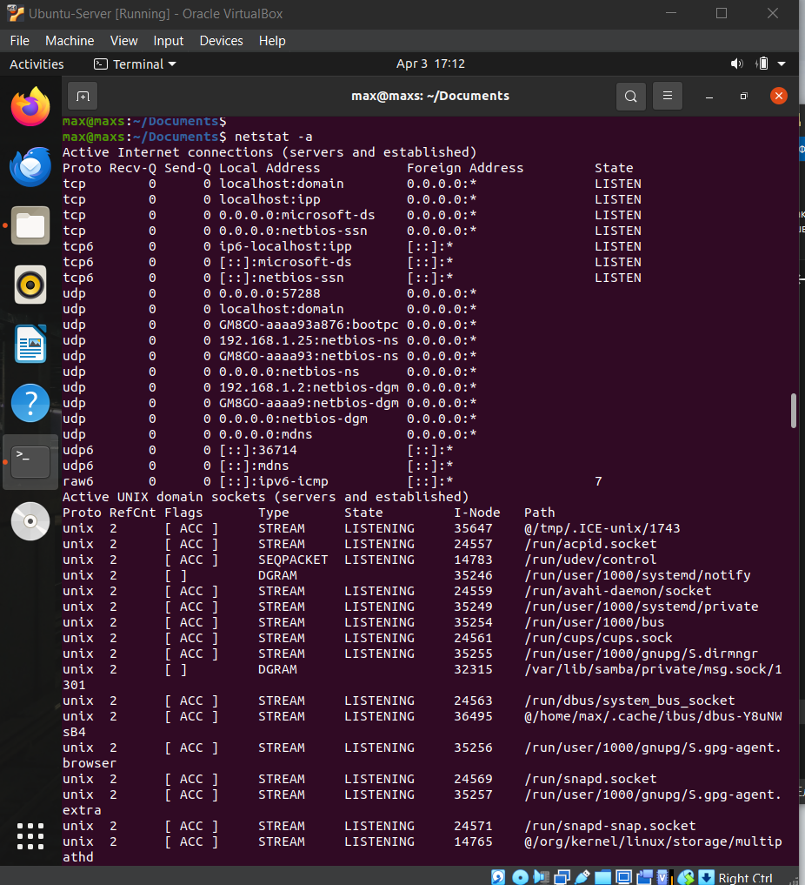
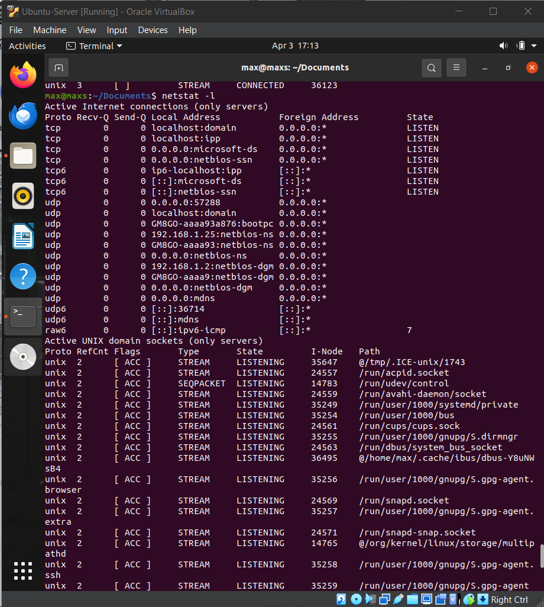
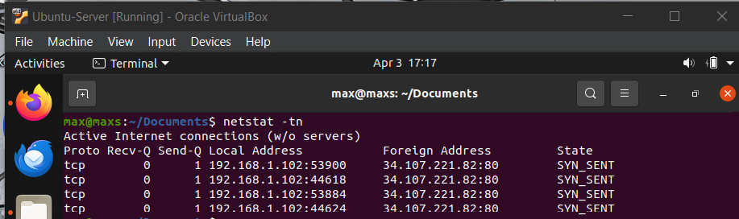
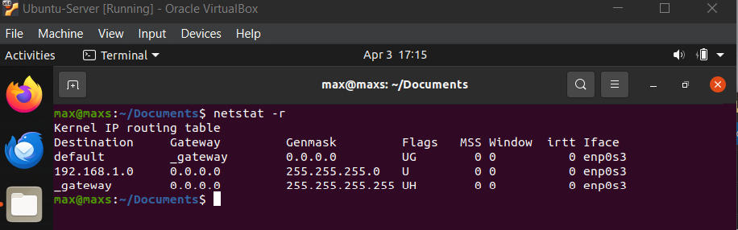

# Лабораторна робота №8
## Тема: Збереження службових даних системи та її мережева конфігурація

## **Мета роботи:**
1. Отримання практичних навиків роботи з командною оболонкою Bash.
2. Знайомство з базовими структурами для збереження системних даних - процеси, память, лог-файли  та повідомлення про стан ядра.
3. Знайомство зі стандартом FHS.
4. Знайомство з діями при налаштуванні мережі.

---

## Матеріальне забезпечення
* ЕОМ типу IBM PC.
* ОС сімейства Windows та віртуальна машина Virtual Box (Oracle).
* ОС GNU/Linux (Arch).
* Сайт мережевої академії Cisco netacad.com та його онлайн курси по Linux

---

## 1. Завдання для попередньої підготовки

### 1.1 — Словник (Dictionary)

| Term | Explanation |
| :--- | :--- |
| Kernel | The kernel is the core part of the operating system that manages hardware and system resources. |
| Process | Process is a running instance of a program that is being executed by the system. |
| Pseudo Filesystem | Pseudo filesystem is a virtual filesystem that exists in memory and provides system information. |
| Log File | Log file is a file that stores messages and records about system and application activity. |
| Packet | Packet is a small unit of data that is transmitted over a network. |
| DNS | DNS is a system that translates domain names into IP addresses. |
| Subnet Mask | Subnet mask is used to define which part of an IP address belongs to the network. |
| Router | Router is a device that connects different networks and forwards data between them. |
| Host | Host is any device connected to a network that can send or receive data. |
| TCP/IP | TCP/IP is a set of communication protocols used for transmitting data over networks. |

### 1.2 — Відповіді на питання

#### 1.2.1 — Псевдо файлова система

Це спеціальний тип файлової системи, який не існує фізично на диску, а створюється ядром Linux у оперативній пам’яті. Спосіб “показати” внутрішній стан системи у вигляді файлів.

Приклад: `/proc` або `/sys`

Призначення:
- надання інформації про процеси, ядро, обладнання
- забезпечення інтерфейсу між ядром і користувачем
- динамічний доступ до стану системи

#### 1.2.2 — Рідкість звертань напряму до `/proc`

Викликана складною структурою, яка не є зручною. Містить багато технічної інформації. Дані змінюються в реальному часі.

Замість прямого перегляду використовують команди:
- `top` — процеси
- `free` — пам'ять
- `ps` — список процесів
- `mount`, `uptime` тощо

Вони читають `/proc` і виводять зручний результат.

#### 1.2.3 — Призначення файлів

`/proc/cmdline` -> параметри запуску ядра (що передано при старті системи)

`/proc/meminfo` -> детальна інформація про використання пам’яті

`/proc/modules` -> список завантажених модулів ядра

#### 1.2.4 — Призначення команди `free`

Вона показує:
- загальну пам’ять
- використану
- вільну
- swap-пам’ять

Приклад виведення:

```Bash
free -h
```

#### 1.2.5 — Лог-файли для чого потрібно

Це файли, де зберігаються повідомлення системи та програм. Вони призначені для діагностики помилок, моніторингу роботи системи та безпеки входу.

Приклади:

- `/var/log/messages` — загальні повідомлення
- `/var/log/secure` — авторизація
- `/var/log/cron` — планувальник задач
- `/var/log/Xorg.0.log` — графічна система

#### 1.2.6 — Призначення файлу `/var/log/dmesg`

Він містить повідомлення ядра під час завантаження системи.

Використовується для:
- діагностики проблем із обладнанням
- перевірки драйверів

Аналог команда:

```Bash
dmesg
```

#### 1.2.7 — Для чого розроблено FHS?

FHS (Filesystem Hierarchy Standard) — стандарт структури файлової системи Linux. Призначений для розташування файлів, спрощення адміністрування, сумісності між дистрибутивами.

Приклад:

- `/etc` — конфігурація
- `/home` — користувачі
- `/var` — змінні дані
- `/bin` — виконувані файли

#### 1.2.8 — Основні команди для перегляду та конфігурації мережі

| Назва команди | Її призначення та функціональність |
| :--- | :--- |
| `ifconfig` | Відображає активні інтерфейси без аргументів. |
| `ip addr show` | Відображення детальної інформації про всі мережеві інтерфейси. |
| `ip route` | Керування таблицею маршрутизації: додавання, видалення та перегляду маршрутів. |
| `netstat` | Відображає активні TCP/UDP-з'єднання, відкриті порти, таблиці маршрутизації та статистику мережевих інтерфейсів. |
| `ss` | Показує TCP/UDP з'єднання, прослуховувані порти та Unix-сокети, надаючи інформацію про процес, який використовує сокет, та поточний стан мережі. |
| `ping` | Надсилає ICMP-запити до цільового пристрою та фіксує ехо-відповіді. |
| `traceroute` | Показує повний маршрут проходження пакетів даних від вашого комп'ютера до цільового сервера (сайту чи IP-адреси). |
| `dig` | Використовується для опитування DNS-серверів та отримання інформації про доменні записи. |
| `host` | Дозволяє дізнатися IP-адресу за доменом, знайти домен за IP, а також отримати інформацію про MX (поштові), NS (DNS-сервери) та TXT-записи для діагностики мережі. |
| `ssh` | Використовується для безпечного віддаленого підключення до серверів та комп'ютерів, керування ними через командний рядок та передачі файлів. |

## 2. Хід роботи 

### 2.1 — Приклади команд з NDG Lab 13 & 14

| Назва команди | Її призначення та функціональність |
| :--- | :--- |
| `su` | Змінюємо поточного користувача на root |
| `ls /proc` | Переглядаємо вміст системного каталогу /proc (для цього потрібні права доступу root) |
| `cat` | Виводить вміст файлу безпосередньо в термінал. |
| `ps -p // -o // -e` | Використовується для перегляду інформації про запущені процеси в системі. Аргумент `-p` показує інформацію про процеси з конкретними PID (ідентифікаторами процесів). `-o` — дозволяє задати формат виводу (які саме поля показувати). `-e` — показує всі процеси в системі.|
| `ping localhost > /dev/null` | Надсилає мережеві пакети до localhost і відкидає вивід (перевірка з’єднання без виводу результату). |
| `jobs` | Показує список фонових процесів (завдань), запущених у поточній оболонці. |
| `kill` | Завершує процес за його PID (ідентифікатором процесу). |
| `killall` | Завершує всі процеси з вказаним іменем. |
| `top` | Відображає інформацію в реальному часі про процеси та використання ресурсів системи. |
| `pkill` | Завершує процеси за ім’ям або іншими параметрами. |
| `sleep` | Призупиняє виконання команди на вказану кількість секунд. |
| `free` | Показує інформацію про використання оперативної пам’яті та swap. |
| `ls /var/log` | Виводить список лог-файлів у каталозі `/var/log`. |
| `ssh localhost` | Підключається до локального комп’ютера через SSH-протокол. |
| `ifconfig` | Відображає або налаштовує мережеві інтерфейси (застаріла команда). |
| `route` | Відображає або змінює таблицю маршрутизації. |
| `grep 127.0.0.1 /etc/hosts` | Шукає IP-адресу `127.0.0.1` у файлі `/etc/hosts`. |
| `ping -c4 localhost` | Виконує 4 запити ping до localhost для перевірки з’єднання. |
| `cat /etc/resolv.conf` | Виводить налаштування DNS (сервери імен) системи. |
| `dig localhost.localdomain` | Виконує DNS-запит для домену `localhost.localdomain`. |
| `dig -x 192.168.1.2` | Виконує зворотний DNS-запит (визначає домен за IP-адресою). |
| `netstat -ltn` | Показує відкриті порти, що прослуховуються (TCP, без DNS-резолвінгу). |
| `ss` | Відображає статистику сокетів і мережеві з’єднання (сучасна заміна `netstat`). |

### 2.2 — Робота в терміналі

#### 1. Дослідження команди `cat`

Вона використовується для: перегляду вмісту файлів, створення нових файлів, об’єднання декількох файлів в один, перенаправлення виводу в інші файли.

#### Створення файлу, його перегляд, перенаправлення та об'єднання:




#### Аргументи команди `cat`

Нумерація рядків:

```Bash
cat -n lab8.txt
```

Відображення недрукованих символів:

```Bash
cat -A lab8.txt
```

Видалення порожніх рядків:

```Bash
cat -s lab8.txt
```

#### 2. Команда `dig`

Використовується для: виконання DNS-запитів, отримання IP-адреси домену, перевірки роботи DNS-сервера, зворотного DNS-пошуку.

#### Отримання IP-адреси домену та її скорочений вивід



#### Зворотний DNS-запит та запит до конкретного DNS-сервера



#### 3. Команда `netstat`

Використовується для: перегляду мережевих з’єднань, відображення відкритих портів, аналізу мережевої активності, перегляду таблиці маршрутизації.

#### Всі активні з'єднання:



#### Прослуховувані порти:



#### TCP-з’єднання без DNS:



#### Таблиця маршрутизації:




---

## Відповіді на контрольні запитання

### 1. Як пов'язані між собою команди `cat` та `tac`?

Команди `cat` та `tac` пов’язані тим, що обидві виводять вміст файлів у термінал, але роблять це по-різному: `cat` читає файл зверху вниз (порядок рядків як у файлі), а `tac` читає файл знизу вгору, тобто виводить рядки у зворотному порядку.

### 2. Що робить команда `ss`?

Команда `ss` використовується для перегляду інформації про мережеві сокети у системі: відкриті TCP/UDP порти, стан з’єднань, адреси та порти локальних і віддалених хостів.

### 3. В чому відмінність між командами `ps --forest` та `pstree`?

Команди `ps --forest` та `pstree` показують процеси ієрархічно. Різниця у відображенні: `ps --forest` показує дерево процесів у текстовій табличній формі в терміналі, а `pstree` виводить процеси у вигляді дерева з графічним відступом імен процесів.

### 4. У яких каталогах зберігаються налаштування системи?

Налаштування системи зберігаються переважно у каталогах /etc (загальні конфігурації) та /var (змінні файли конфігурацій, логи).

### 5. У яких каталогах можна знайти встановлені в системі програми, доступні для користувача?

Встановлені програми для користувача зазвичай знаходяться у /usr/bin, /usr/local/bin.

### 6. У яких каталогах можна знайти встановлені системні програми і програми призначені для виконання суперкористувачем?

Встановлені програми для користувача зазвичай знаходяться у /usr/bin, /usr/local/bin, а системні програми та утиліти для суперкористувача – у /sbin, /usr/sbin.

### 7. Поясніть призначення команд `ping`, `ifconfig`, `traceroute`.

| Назва команди | Її призначення та функціональність |
| :--- | :--- |
| `ping` | Перевіряє доступність віддаленого хоста через ICMP і вимірює час відгуку. |
| `ifconfig` | Показує або налаштовує параметри мережевих інтерфейсів (IP-адресу, маску, MAC-адресу тощо). |
| `traceroute` | Визначає маршрут пакетів до віддаленого хоста, показуючи проміжні вузли та час проходження. |

### 8. Як називаються мережеві інтерфейси в Linux?

Мережеві інтерфейси в Linux зазвичай називаються як eth0, eth1, enp3s0, wlan0 або lo для локального інтерфейсу (loopback).

### 9. Як за допомогою команди `ifconfig` вивести параметри тільки одного мережевого інтерфейсу (наприклад, eth1), а не всіх?

Команда `ifconfig eth1`, це покаже лише інформацію про eth1, без інших інтерфейсів.

---
## Висновок (Conclusion)
During this practical work, we gained practical experience using the Bash shell to run commands, manage files, and automate routine tasks. We studied the main system information structures, 
including processes, memory usage, log files, and kernel messages. We also became familiar with the Filesystem Hierarchy Standard (FHS) and how it organizes directories and files in Linux. 
In addition, we covered basic network configuration tasks, which helped build an understanding of how network settings are managed in a Linux system.


---

## Team Contributions
- **Member 1 ([Shanson777])**: Registered almost full report, created sheet of terms
- **Member 2 ([Pisk08])**:  Did technical part of work and took screenshots
- **Member 3 ([Vangus387474])**:  Did 2 task "Приклади команд з NDG Lab 9 & 10", did sheet and conclusion
