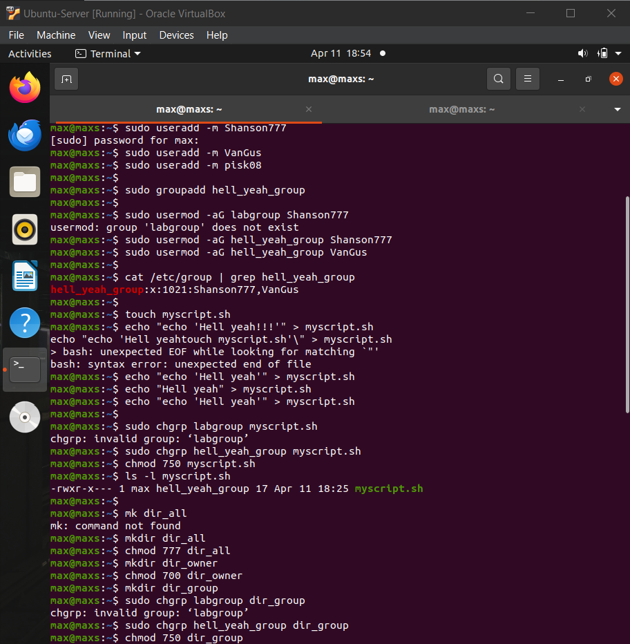
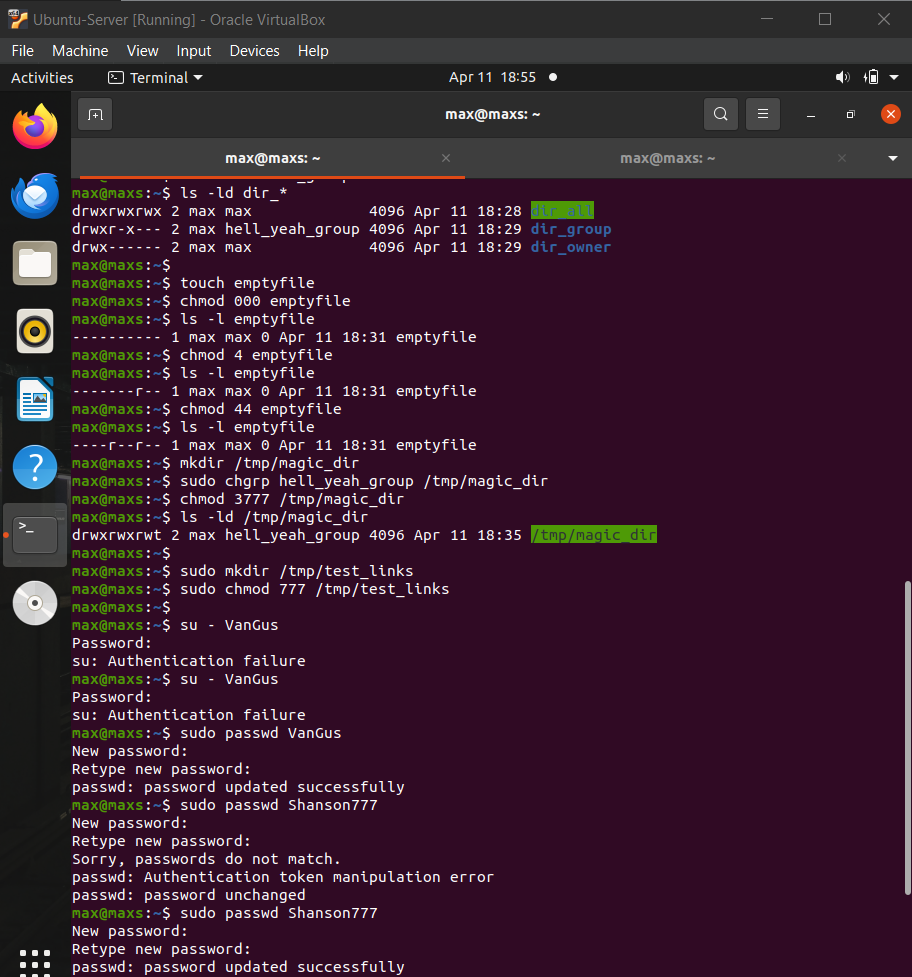
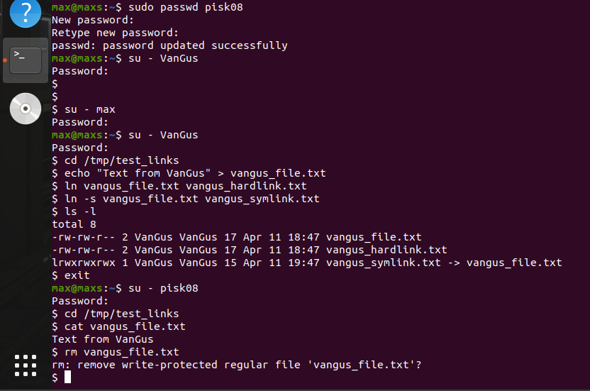

# Лабораторна робота №10
## Тема: Зміна власників і прав доступу до файлів в Linux. Спеціальні каталоги та файли в Linux

## **Мета роботи:**
1. Отримання практичних навиків роботи з командною оболонкою Bash.
2. Знайомство з базовими діями при зміні власників файлів, прав доступу до файлів.
3. Знайомство з спеціальними каталогами та файлами в Linux.


---

## 1. Завдання для попередньої підготовки

### 1.1 — Словник (Dictionary)

| Term | Explanation |
| :--- | :--- |
| File ownership | The concept that every file has an owner (user) and a group. |
| User owner | The user who owns a file. |
| Group owner | The group associated with a file. |
| Permissions | Rules that define access to files (read, write, execute). |
| Read (r) | Permission to view file contents. |
| Write (w) | Permission to modify a file. |
| Execute (x) | Permission to run a file as a program. |
| Default permissions | Permissions assigned when a file is created. |
| Hidden file | File whose name starts with a dot (`.`). |
| Primary group | The main group assigned to a user. |
| Supplementary groups | Additional groups a user belongs to. |
| Binary file | Executable program file. |
| setuid | Special permission that runs a file as its owner. |
| setgid | Special permission that runs a file with group privileges. |
| Sticky bit | Permission that restricts file deletion in shared directories. |

### 1.2 — Відповіді на питання

#### 1.2.1 — Призначення команди id?

Використовується для відображення інформації про користувача:
- UID (ідентифікатор користувача)
- GID (ідентифікатор основної групи)
- список додаткових груп

#### 1.2.2 — Перегляд прав доступу які має власник файлу

Права доступу переглядаються за допомогою команди:

```Bash
ls -l
```

У виводі:

```Bash
-rwxr-xr--
```

Перші 3 символи (`rwx`) — це права власника файлу.

#### 1.2.3 — Зміна власника групи?

Для зміни групи файлу використовуються команди:

```Bash
chgrp groupname filename
```

Або:

```Bash
chown :groupname filename
```

#### 1.2.4 — Перегляд у терміналі який тип поточного файлу

Використовується команда:

```Bash
ls -l
```

Перший символ показує тип файлу:
- `-` — звичайний файл
- `d` — директорія
- `l` — символічне посилання

Приклад:

```Bash
drwxr-xr-x  -> directory
-rw-r--r--  -> regular file
lrwxrwxrwx  -> symlink
```

Також можна використати:

```Bash
file filename
```

#### 1.2.5 — Setuid та Setgid

- Setuid (Set User ID) — дозволяє запускати програму від імені власника файлу (часто root). Використовується, коли звичайному користувачу потрібен доступ до системних ресурсів.

Приклад: команда `passwd` (змінює пароль користувача).

- Setgid (Set Group ID)

Має 2 варіанти:
- Для файлів: програма виконується з правами групи власника.
- Для директорій: всі нові файли автоматично отримують групу директорії.

Використовується для спільної роботи користувачів.

#### 1.2.6 — Sticky Bit

Sticky Bit — це спеціальний дозвіл, який обмежує видалення файлів у спільних директоріях.

Якщо він встановлений:
* файл може видалити тільки:
  - власник файлу
  - власний директорії
  - root

Приклад:

Каталог: `/tmp` має права `drwxrwxrwt` — `t` означає наявність Sticky Bit, аби користувачі не могли видаляти файли інших.

## 2. Хід роботи 

### 2.1 — Приклади команд з NDG Lab 17 & 18

| Назва команди | Її призначення та функціональність |
| :--- | :--- |
| `chmod` | Зміна прав доступу до файлу. Аргументи: `a+x` — додає право виконання (x) для всіх (user, group, others), `g-w` — забирає право запису (w) у групи, `go+r` — додає право читання (r) для групи та інших, `o=rwx` — встановлює для інших користувачів повні права (rwx) |
| `chown` | Зміна власника та/або групи файлу. |
| `chgrp -R` | Зміна групи файлу або каталогу. Аргумент: `-R` — рекурсивно змінює групу для каталогу і всіх його файлів. |
| `ls -ladi` | Виведення детальної інформації про файли. Аргументи: `-l` — детальний формат (права, власник, розмір, дата), `-a` — показує приховані файли (`.` і `..`), `-d` — показує інформацію про каталог, а не його вміст, `-i` — показує inode (унікальний номер файлу)|
| `stat` | Показує детальну інформацію про файл або каталог. |
| `passwd` | Зміна пароля користувача. |
| `wall` | Надсилання повідомлення всім користувачам у системі. |
| `rm` | Видаляє файли і каталоги. |
| `ln -s` | Створення символічного (soft) посилання. |

### 2.2 — Робота в терміналі

#### 1-4. Створення 3 користувачів, групи та додавання до неї. Створення Shell-скрипта. Налаштування прав доступу. Робота з директоріями.



#### 5-7. Експеримент з chmod. Каталог з setgid + sticky bit. Файли і посилання (під кожним користувачем)



#### 8-9. Перевірка доступу іншими користувачами. Спроба видалення



---

## Відповіді на контрольні запитання

### 1. Наведіть приклади зміни прав доступу символічним методом (Symbolic Method)?

Зміна прав символічним методом (`chmod`) може виглядати так: `chmod u+x file` додає право виконання для власника, `chmod g-w file` забирає право запису для групи, `chmod o=r file` встановлює лише право читання для інших.

### 2. Наведіть приклади зміни прав доступу числовим методом (numeric method, octal method)?

Зміна прав числовим методом використовує трьохзначні числа: `chmod 755 file` дає `rwx` власнику та `r-x` групі й іншим, а `chmod 644 file` дає `rw-` власнику та `r--` групі й іншим.

### 3. Яке призначення команди `umask`?

Команда `umask` задає маску прав доступу за замовчуванням, тобто визначає, які біти прав будуть автоматично відключені при створенні нових файлів чи каталогів.

### 4. Порівняйте жорсткі та символічні посилання?

Жорстке посилання вказує на той самий `inode`, тому всі імена посилання ведуть до одного файлу, не можна створити для директорій або на різних файлових системах. Символічне посилання – це окремий файл, що містить шлях до оригіналу, підтримує директорії та різні файлові системи.

### 5. Чи можна виконати файл, для якого є права на виконання, але не встановлені права на читання (--x)? Поясніть.

Файл з правами `--x` можна виконати, якщо відомо його ім’я та місце, але прочитати його вміст неможливо.

### 6. Якщо ми змінюємо права доступу та дозволи в поточній сесії чи будуть вони збережені в наступній?

Зміни прав доступу в поточній сесії впливають лише на конкретні файли і не зберігаються для нових файлів у майбутніх сесіях.

### 7. Чи є якийсь шаблон, яким система користується щодо прав та доступів при створенні нових файлів. Як можна змінити права дозволу за замовчуванням?

При створенні нових файлів система використовує шаблон за замовчуванням, який визначається `umask`. Щоб змінити права за замовчуванням, потрібно встановити іншу маску через `umask <число>`.

### 8. Яким чином можна створити жорстке посилання? В яких ситуаціях їх доцільно використовувати?

Жорстке посилання створюють командою `ln original.txt hardlink.txt`. Доцільно використовувати, коли потрібно мати кілька імен одного файлу, економити місце на диску та синхронізувати зміни через всі посилання.

### 9. Яким чином можна створити символічне посилання? В яких ситуаціях їх доцільно використовувати?

Символічне посилання створюють командою `ln -s /path/to/original.txt symlink.txt`. Використовують для зручності доступу, для директорій або коли оригінальний файл знаходиться на іншій файловій системі.

### 10. Уявіть, що програмі потрібно створити одноразовий тимчасовий файл, який більше ніколи не знадобиться після закриття програми. Який правильний каталог для створення цього файлу?

Для одноразових тимчасових файлів, які більше не потрібні після завершення програми, правильний каталог – /tmp або /var/tmp.

### 11. Є файл оригінал та для нього створено два посилання - символічне та жорстке. Що відбудеться з іншими файлами, якщо видалити:

| Назва | Наслідок |
| :--- | :--- |
| Файл оригінал | Видалення оригіналу робить символічне посилання битим, але жорстке посилання залишається дійсним. |
| Символічне посилання | Видалення символічного посилання не впливає на інші файли. |
| Жорстке посилання | Видалення жорсткого посилання не видаляє оригінал чи інші жорсткі посилання, поки хоча б одне ім’я файлу існує. |
---

## Висновок (Conclusion)
Special attention was given to access control mechanisms such as chmod, chown, and chgrp, which provide flexible management of permissions for files and directories.

Advanced permission settings — setuid, setgid, and the sticky bit — were also examined as enhanced security mechanisms that modify standard access behavior to enable controlled execution, effective management of shared resources, and protection of shared directories.

Practical tasks included creating users and groups, assigning ownership, configuring permissions, and verifying access behavior for different users. Experiments with directories, scripts, and symbolic links demonstrated how Linux enforces security policies in real-world scenarios.


---

## Team Contributions
- **Member 1 ([Shanson777])**: Registered almost full report, created sheet of terms
- **Member 2 ([Pisk08])**:  Did technical part of work and took screenshots
- **Member 3 ([Vangus387474])**:  Did 2 task " Приклади команд з NDG Lab 17 & 18 ", did sheet and conclusion
