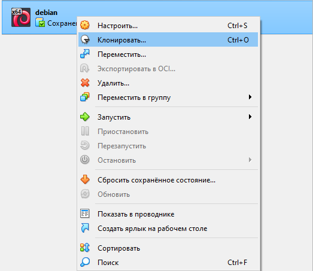

# Workcase 2

## Виконали: Піскун М.О., Божок Т.Ю., Гусєв І.Ю.

##  1. Клонування віртуальної робочої ОС
Cпочатку потрібно по вже готовій ВМ клікнути ПКМ та вибрати "Клонування"

###  *Рис. 1. вікно після ПКМ по ВМ*
