# Звіт з виконання практичного завдання "Work-case 3"
**Дисципліна:** Операційні системи
**Тема:** Клонування, експорт та мережева взаємодія віртуальних машин

## 1. Клонування віртуальної ОС
Клонування було виконано засобами гіпервізора VirtualBox.
**Етапи:**
1. Вибір основної ВМ -> Контекстне меню -> "Clone".
2. Налаштування політики MAC-адрес: "Generate new MAC addresses" (для уникнення конфліктів IP).
3. Тип клону: "Full Clone" (повне копіювання стану диска).
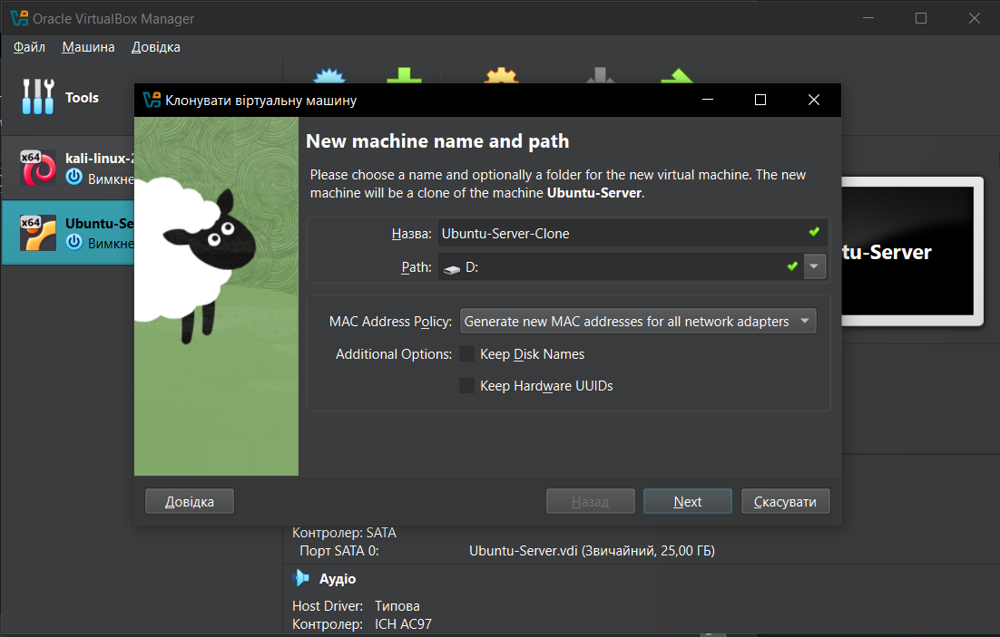

## 2. Експорт віртуальної ОС
Для перенесення ОС в інше середовище використано функцію **Export Appliance**.
- **Формат файлу:** Open Virtualization Format 1.0 (.ova).
- **Результат:** Створено єдиний файл, що містить конфігурацію та образ диска, готовий до імпорту на іншому гіпервізорі.

 
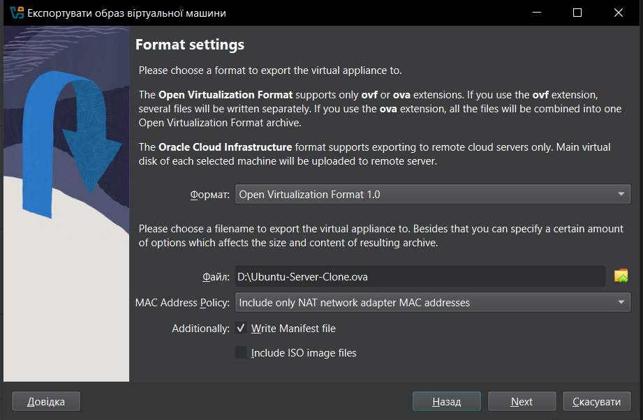

## 3. Типи мережевих з’єднань

- **NAT:** ВМ використовує IP-адресу хоста для виходу в мережу. Оптимально для доступу до інтернету.
- **Bridged (Мережевий міст):** ВМ підключається безпосередньо до фізичної мережі. Отримує власну IP-адресу від роутера.
- **Host-only:** Створюється приватна мережа між фізичним ПК та віртуальними машинами.
- **Internal Network:** Мережа виключно між віртуальними машинами, ізольована від хоста та інтернету.

## 4. Налаштування мережі та перевірка зв'язку
Для роботи обрано режим **Bridged Adapter**.

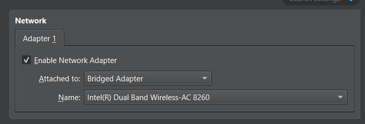

**Базові команди термінала для налаштування ОС:**
- `ip a` або `ifconfig` — перегляд призначених IP-адрес.
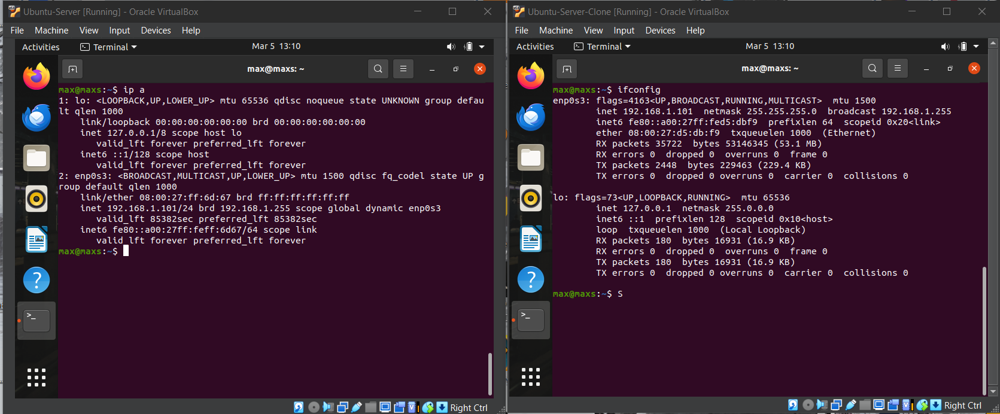

- `sudo rm /etc/machine-id` -Генеруємо новий ID для клона
- `sudo systemd-machine-id-setup` - Створюємо новий
- `sudo reboot` - Перезавантажуємо машину, щоб зміни набули чинності
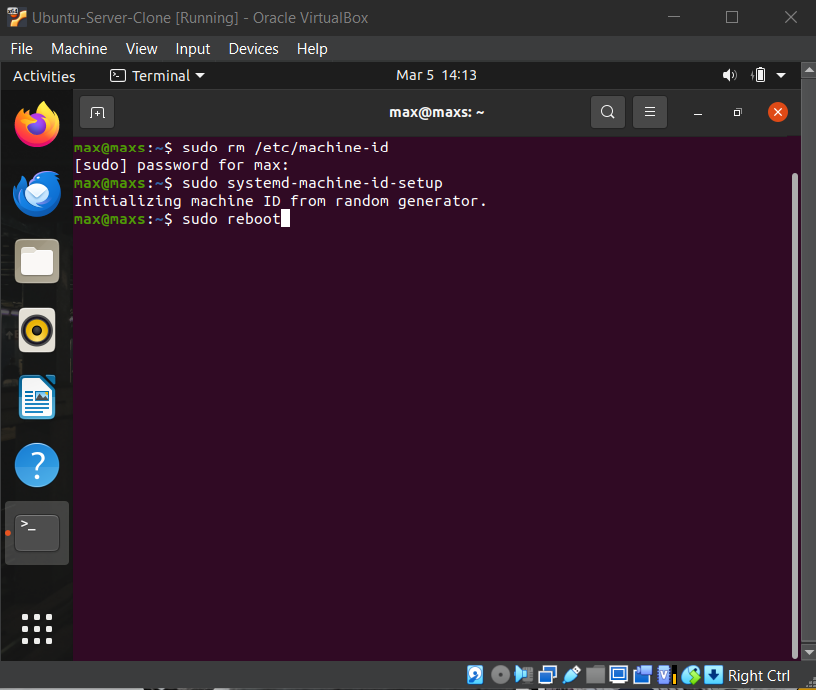

**Обмін повідомленнями між машинами. Використано утиліту `netcat` (nc).**
- `ping -с 3 [IP-адреса клона]` — перевірка наявності зв'язку між машинами 
- `nc -l 1234` — на оригінальній машині.
- `nc 192.168.1.101 1234` -  
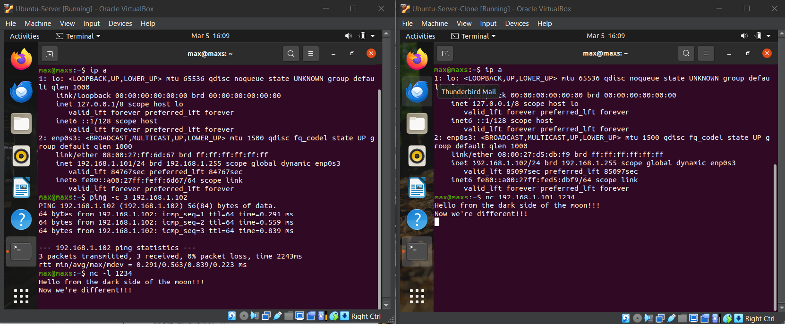

**Перегляд відео на YouTube: Виконано успішно на обох ВМ**
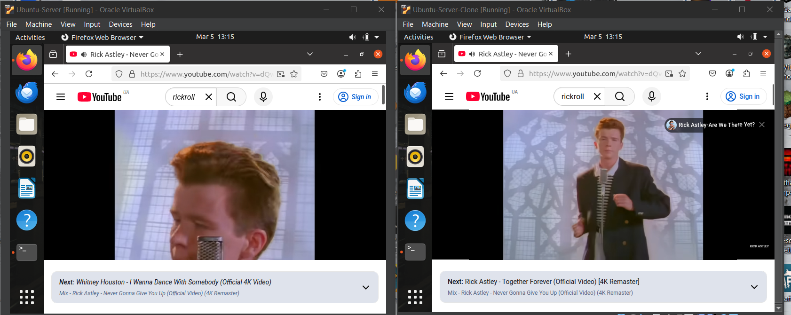

## 5. Спільні ресурси та обмін файлами
### Між віртуальними ОС:
*На основній машині*
`sudo apt update`
`sudo apt install samba`
`mkdir ~/shared_folder`
`chmod 777 ~/shared_folder`
`sudo nano /etc/samba/smb.conf`
`[shared]`
`path = /home/max/shared_folder`
`browseable = yes`
`read only = no`
`guest ok = yes`

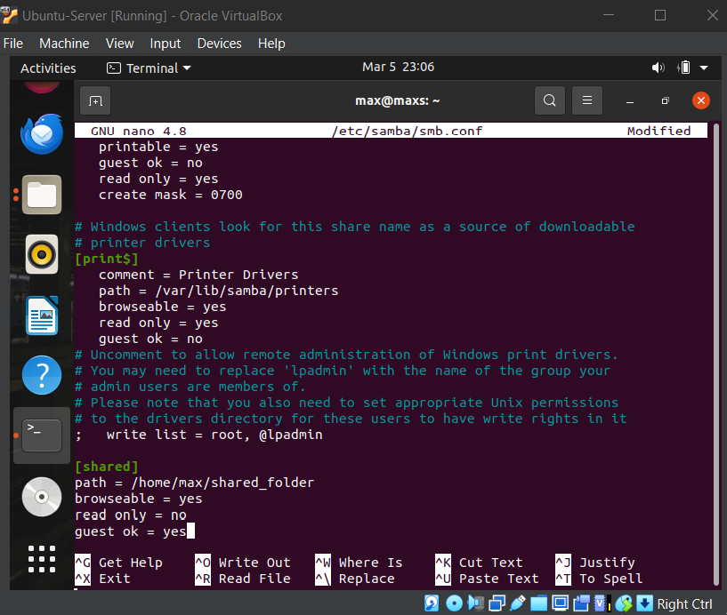

`sudo systemctl restart smbd`
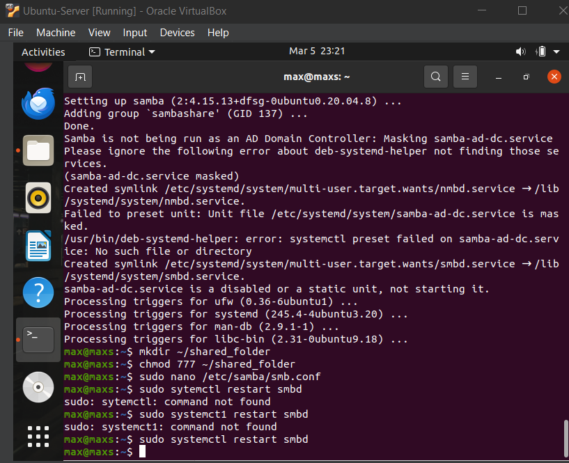

*На клонованій*
Відкрити термінал
`sudo apt update`
`sudo apt install cifs-utils`
`sudo mkdir -p /home/max/shared_folder`
`sudo mount -t cifs` ”//maxs.local/shared”  /home/max/shared_folder -o “username=max,uid=1000,gid=1000”
 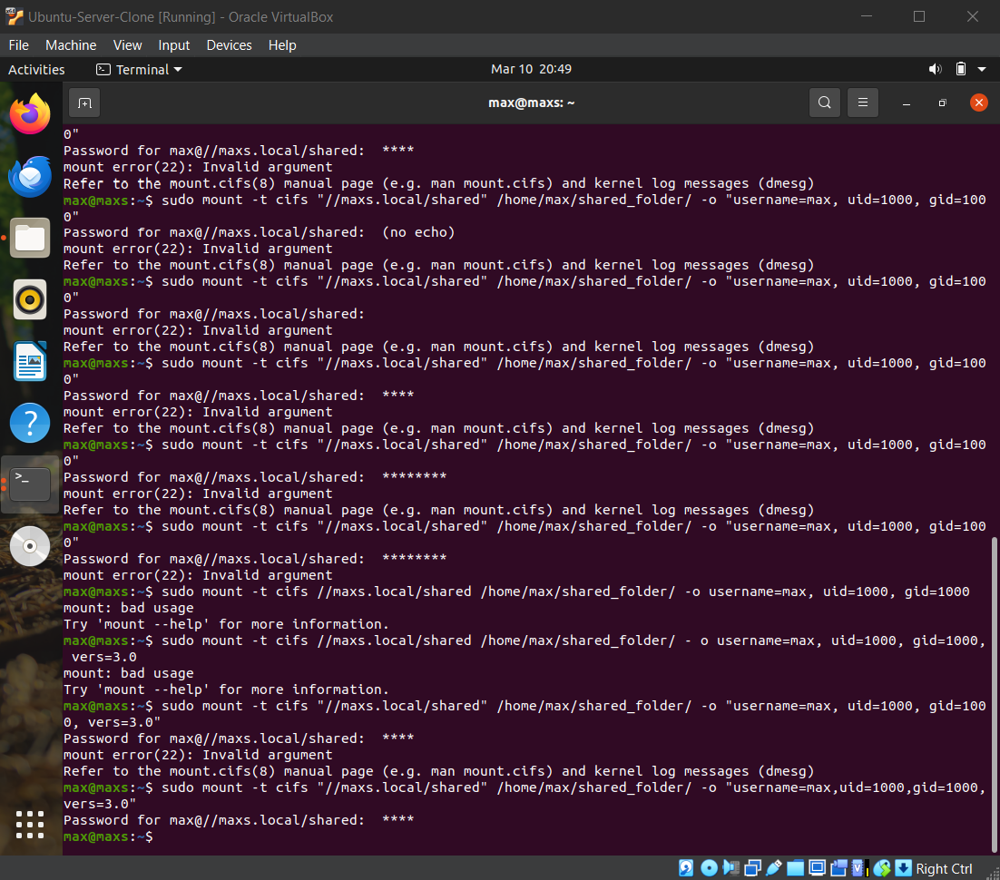
 

копіюємо файли з цієї директорії в домашній каталог користувача (віртуальна робоча ОС) та на робочій стіл (клон віртуальної робочої ОС) за допомогою ПКМ потрібний файл в мережевій директорії  →  Copy →  Paste в директорії яка нам потрібна, або за допомогою команди `cp *джерело призначення*`

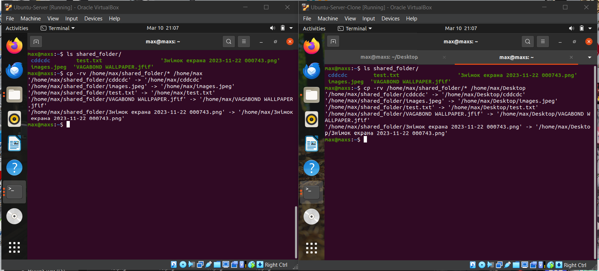

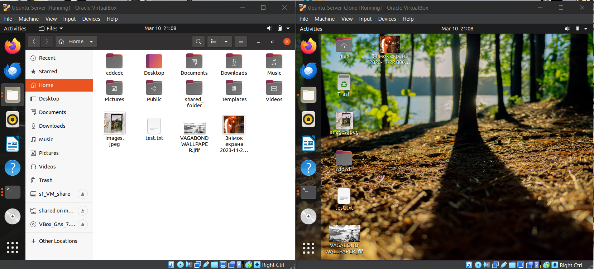

### Між хостом (Windows) та ВМ:

На Windows створити теку D:\VM_share
У Oracle VirtualBox відкрити: Settings → Shared Folders Натиснути →  Add new shared folder →  Вибрати папку на комп’ютері  → Увімкнути ✓ Auto-mount
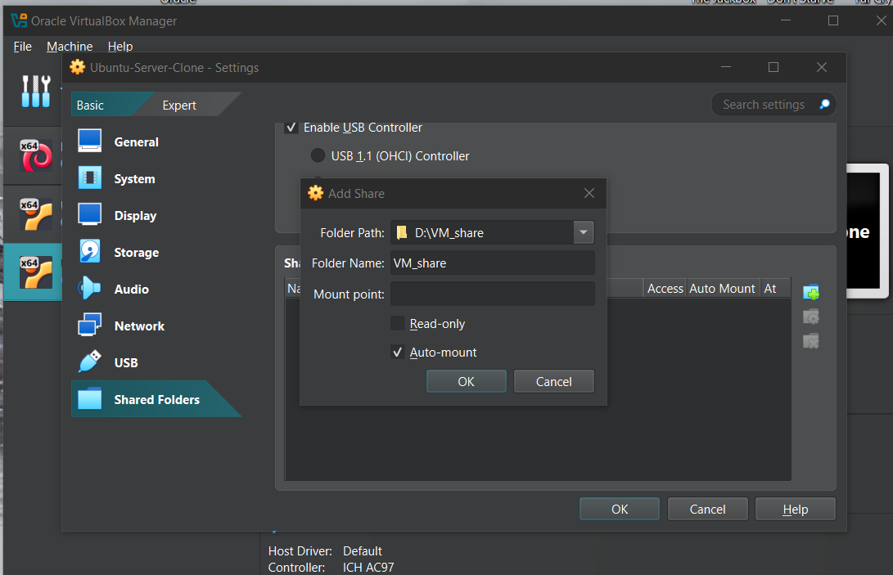

У запущеній Ubuntu: У верхньому меню VirtualBox натисни: Devices → Insert Guest Additions CD Image
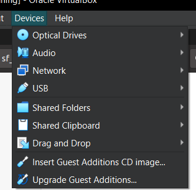

`sudo usermod -aG vboxsf $USER`
`sudo reboot`
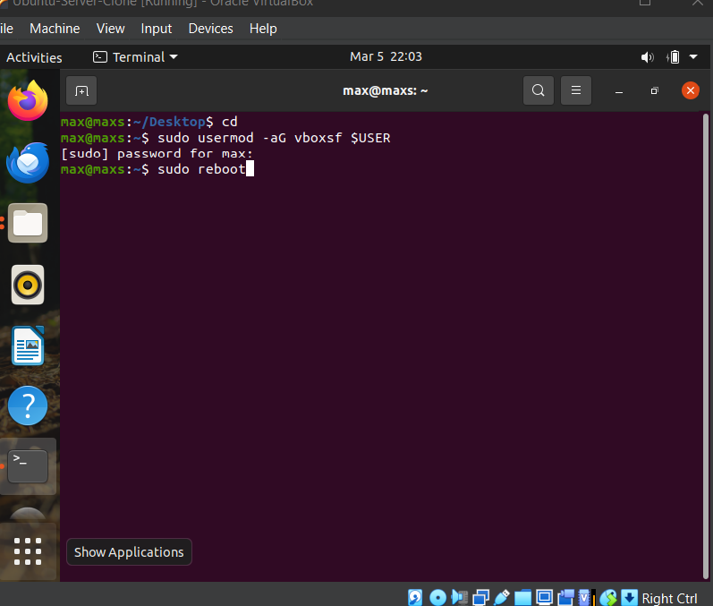

Відкрийти Files → sf_VM_share.
Повторити для клона
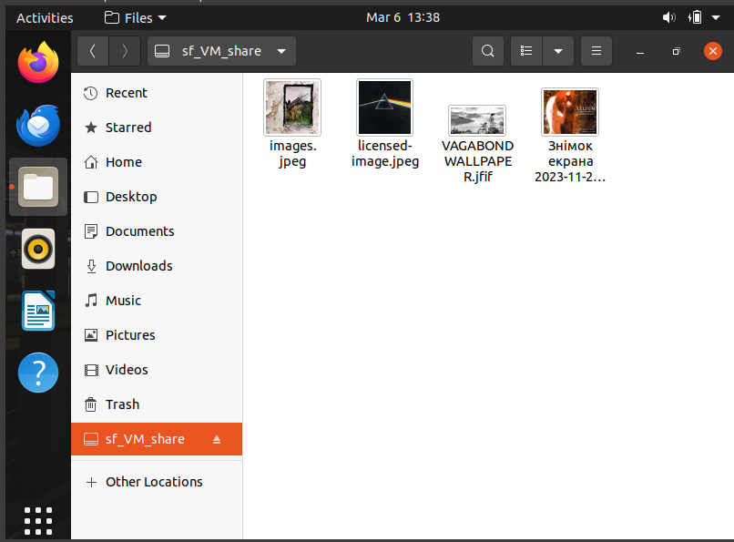

копіюємо файли з цієї директорії на робочій стіл віртуальних машин за допомогою ПКМ потрібний файл в мережевій директорії  →  Copy →  Paste в директорії яка нам потрібна, або за допомогою команди `cp *джерело призначення*`. На Windows: передати в мережеву → D:\VM_share → вставляємо/копіюємо файл який потрібний, щоб дістати файл з мережевої → D:\VM_share → вставляємо/копіюємо куди нам потрібно.
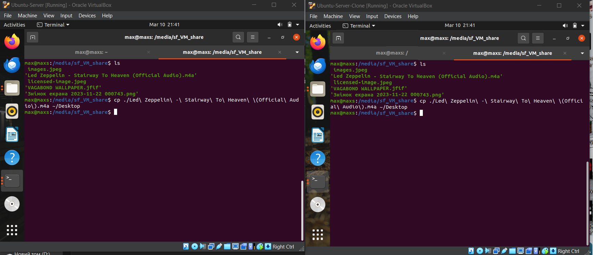

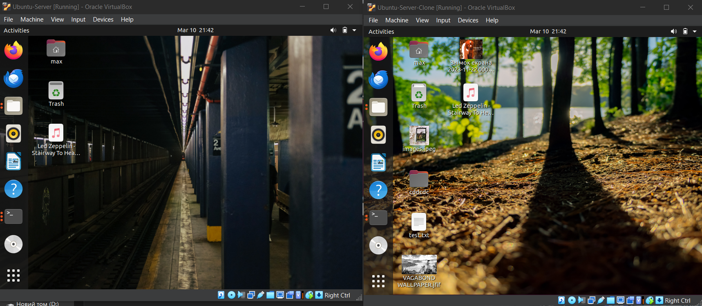

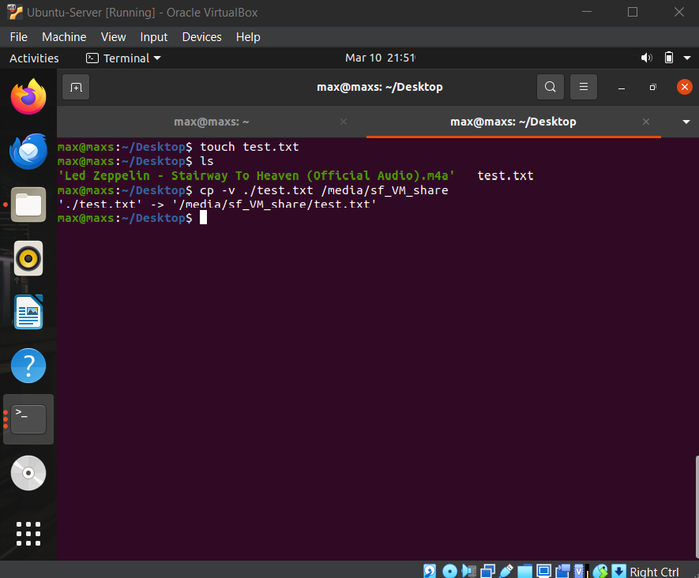

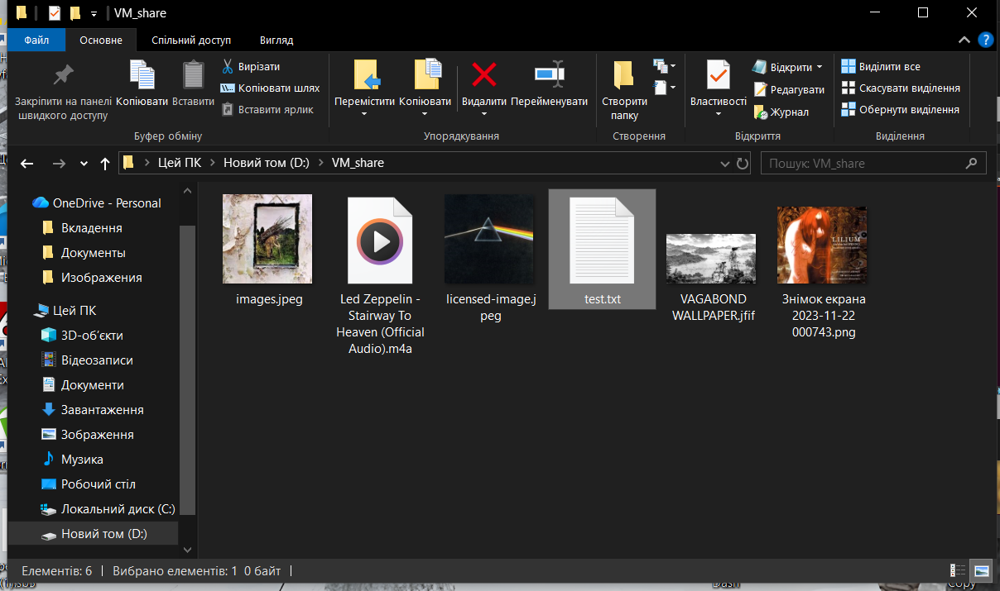

## Висновок
В ході роботи було опановано методи адміністрування ВМ, налаштування різних типів мереж та способи міграції даних між гостьовими та хостовими системами.
