# Практичне завдання “Work-case 4”: Робота з менеджерами пакетів

---

## 1. Теоретичні відомості: Пакети та Репозиторії

* **Пакет:** Це стандартизований архівний файл (наприклад, `.deb` для Ubuntu), який містить скомпільовані бінарні файли програми, файли конфігурації, інструкції для встановлення та список залежностей (інших пакетів, необхідних для роботи).
* **Репозиторій:** Це централізоване, віддалене сховище пакетів (сервер), з якого менеджер пакетів системи завантажує програмне забезпечення та його оновлення.

**Огляд існуючих менеджерів пакетів:**
1.  **APT (Advanced Package Tool):** Використовується в Debian/Ubuntu. Формат пакетів: `.deb`. Надійний інструмент з автоматичним вирішенням залежностей.
2.  **DNF / YUM:** Використовується в RedHat/Fedora. Формат: `.rpm`.
3.  **Pacman:** Використовується в Arch Linux. Відрізняється високою швидкістю та підходом "rolling release".
4.  **Snap / Flatpak:** Універсальні пакетні менеджери нового покоління. Ізолюють програми в "пісочницях" (sandbox) та містять всі залежності всередині одного великого пакета.

---

## 2. Робота з менеджером пакетів в Ubuntu (APT)

В моєму дистрибутиві (Ubuntu) за замовчуванням використовується пакетний менеджер **APT**. 

**Основні команди для роботи в терміналі:**

* **Оновлення локального списку пакетів (синхронізація з репозиторіями):**
    ```
    sudo apt update
    ```

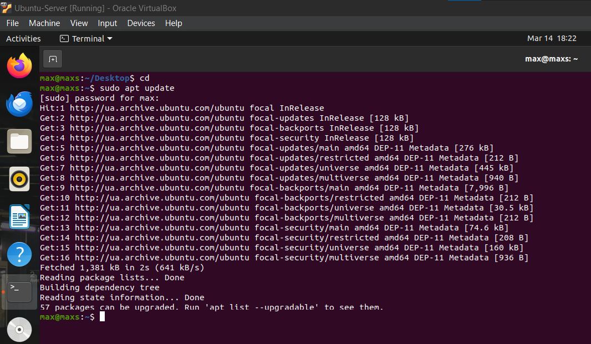

* **Оновлення всіх встановлених пакетів (та самого менеджера) до актуальних версій:**
    ```
    sudo apt upgrade
    ```

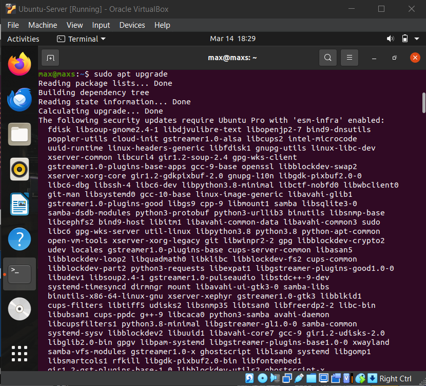

* **Пошук пакету за назвою:**
    ```
    apt search <назва_програми>
    ```
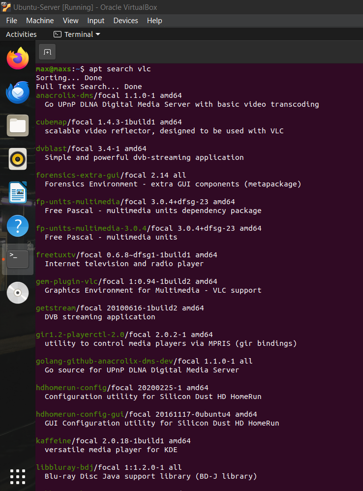

* **Перегляд інформації про пакет:**
    ```
    apt show <назва_пакету>
    ```
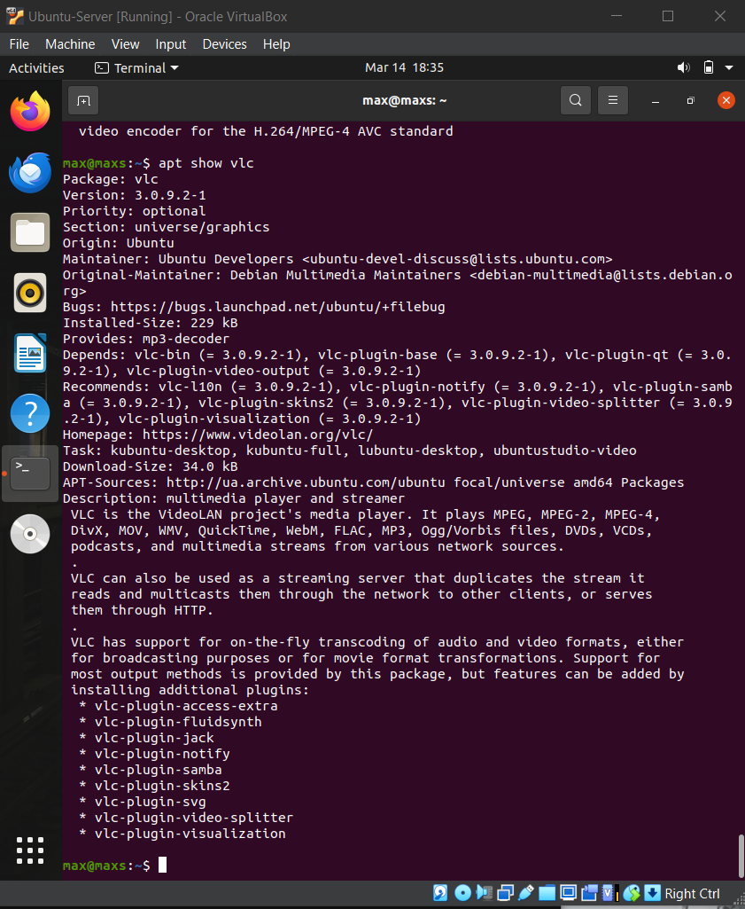

* **Перегляд інформації про всі встановлені пакети.:**
    ```
    apt list —installed
    ```
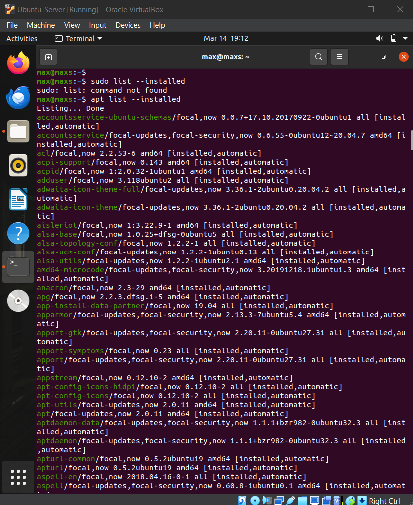

* **Встановлення нового пакету зі стандартного репозиторію:**
    ```
    sudo apt install <назва_пакету>
    ```
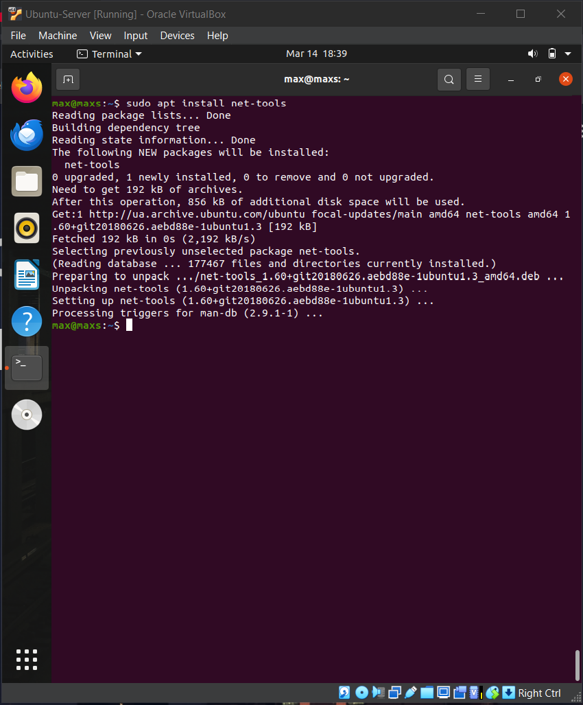

* **Додавання нового стороннього репозиторію (PPA) та встановлення з нього:**
    ```
    sudo add-apt-repository ppa:<автор>/<назва_сховища>
    sudo apt update
    sudo apt install <назва_пакету>
    ```
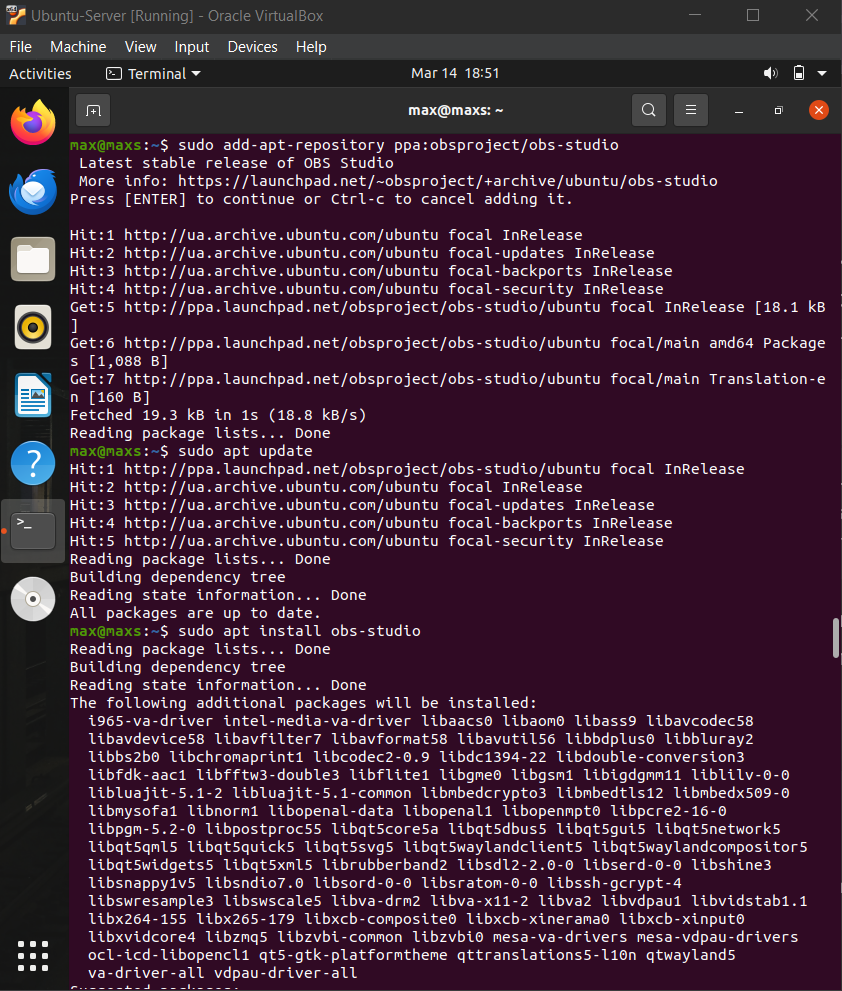

* **Видалення пакету (із збереженням файлів конфігурації):**
    ```
    sudo apt remove <назва_пакету>
    ```
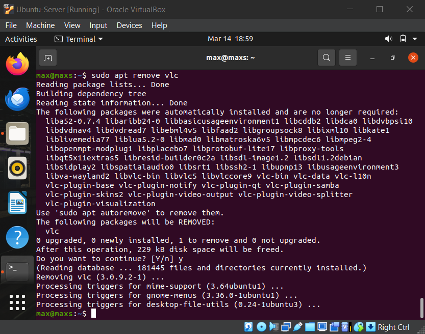

* **Повне видалення пакету та його конфігурацій:**
    ```
    sudo apt purge <назва_пакету>
    ```
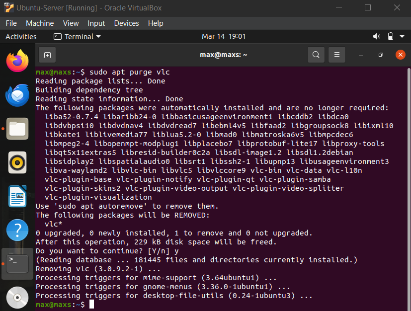


* **Видалення "сирітських" пакетів (застарілих залежностей):**

    ```
    sudo apt autoremove
    ```

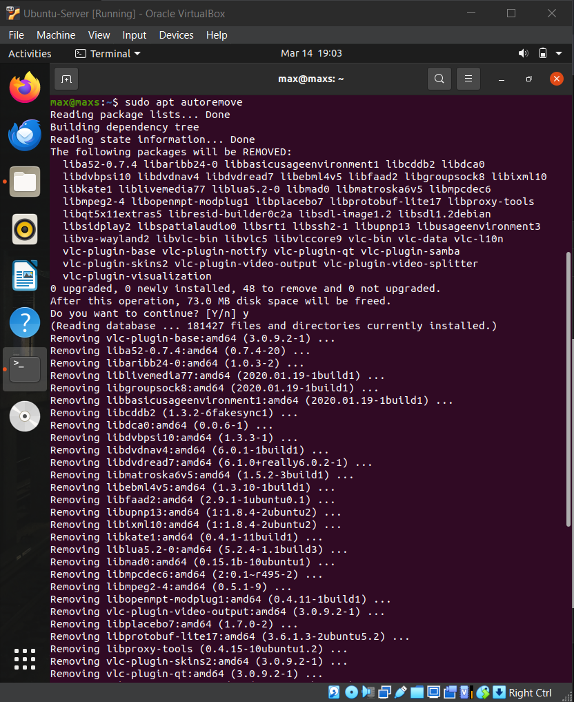

---

## 3. Практичне встановлення ПЗ через термінал

В ході виконання роботи було встановлено наступне програмне забезпечення:

**1. Відеоплеєр VLC:**
Потужний медіаплеєр з підтримкою більшості кодеків.
```
sudo apt install vlc
```
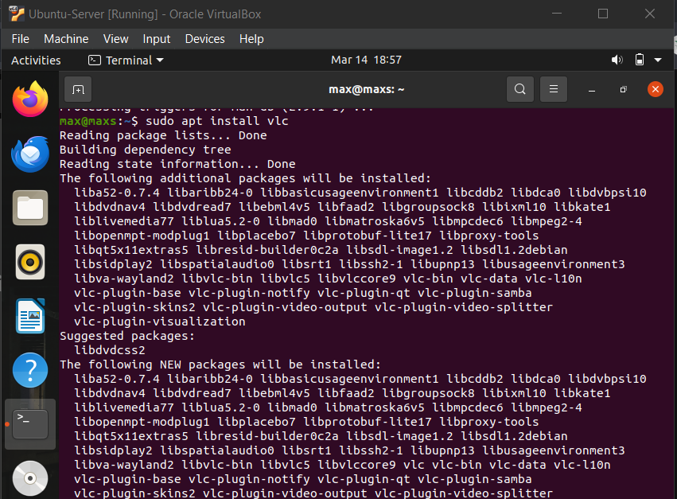

**2.Середовище для програмування на C++: Для розробки на C++ був встановлений мета-пакет build-essential, який включає компілятор g++, gcc, інструмент make та базові бібліотеки::**

* **Встановлення build-essential та перевірка наявності компілятора g++:**
    ```
    sudo apt install build-essential 
    g++ --version
    ```
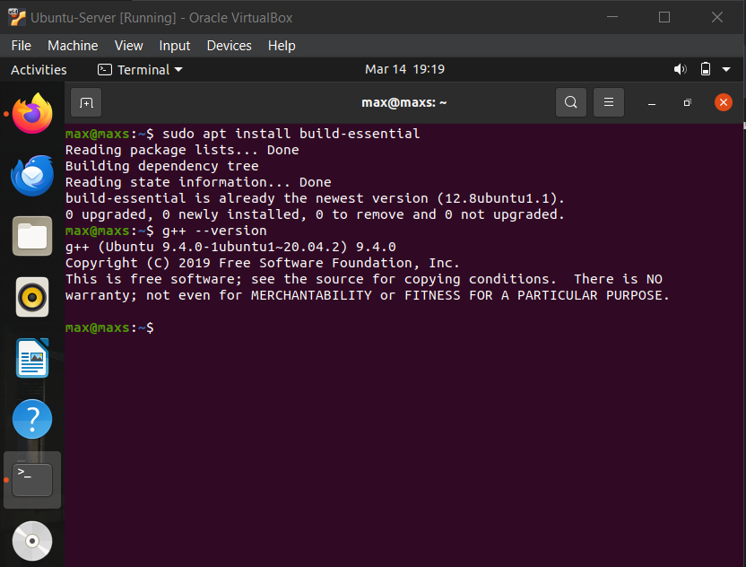

## 4. Встановлення програм через графічне середовище (GUI)
**Алгоритм (приклад встановлення Spotify):**
Відкрити додаток App Center з меню додатків.
Використати рядок пошуку для знаходження потрібної програми (наприклад, "Spotify").
Обрати програму зі списку результатів.
Натиснути кнопку "Install" (Встановити).
Система запросить введення пароля адміністратора (sudo) для підтвердження інсталяції.
Після завершення процесу програма з'явиться у головному меню застосунків.
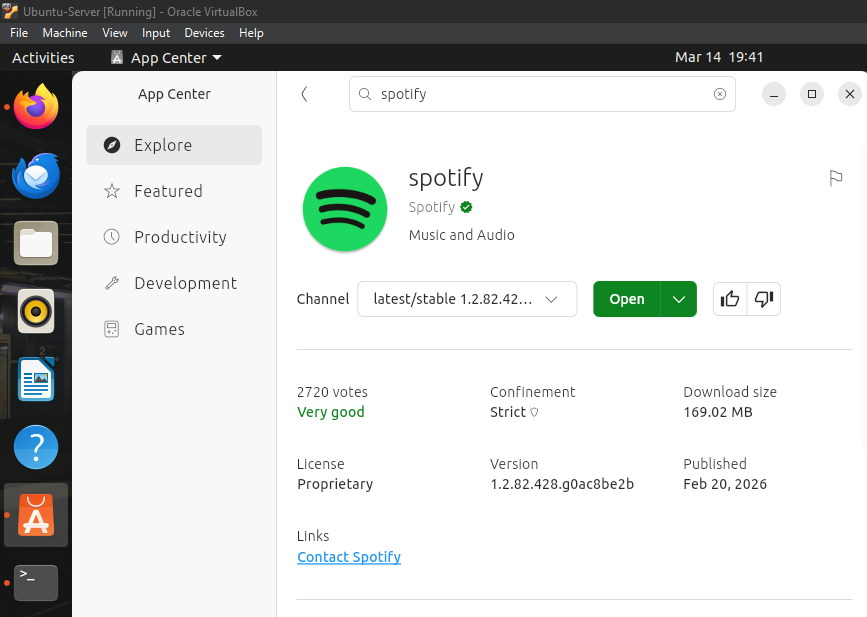

## Consulations

WC4 In this practical work, the principles of package management in Linux were studied and applied using the APT package manager in Ubuntu. The concepts of packages and repositories were explored, along with the role they play in software installation and system maintenance.

During the practical part, essential commands for updating, searching, installing, and removing software were successfully executed. Additionally, real-world tasks such as installing VLC media player and a C++ development environment were completed. Both terminal-based and graphical methods of software installation were examined, highlighting their convenience and flexibility.


Overall, this work helped develop practical skills in managing software on a Linux system, as well as a deeper understanding of how package managers simplify system administration and ensure software reliability through dependency management.

## Team Contributions
- **Member 1 ([Shanson777])**: Created text for almost full report, did consulation
- **Member 2 ([Pisk08])**:  Did technical part of work and took screenshots
- **Member 3 ([Vangus387474])**:  Registered full text of report and did theoretical tasks
