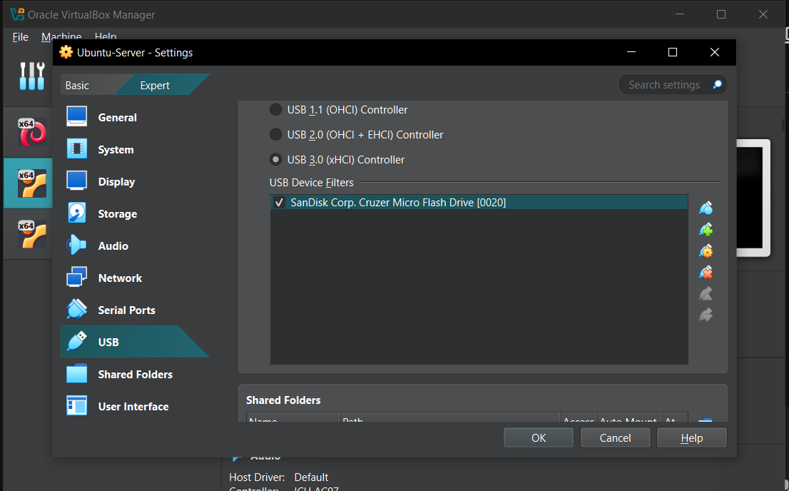
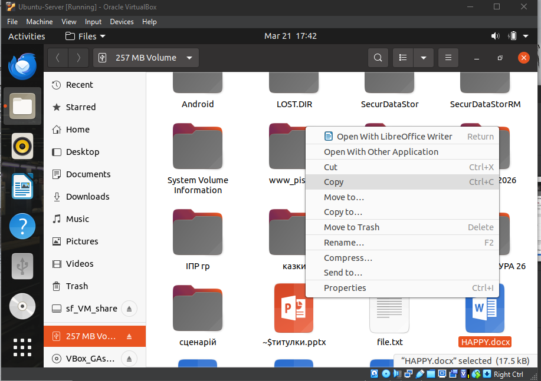
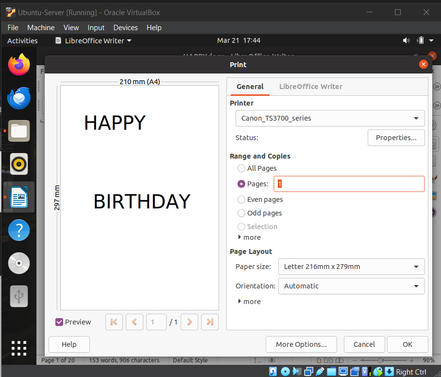
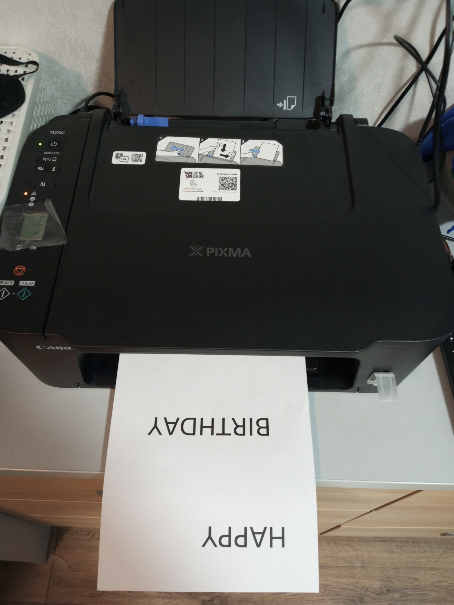
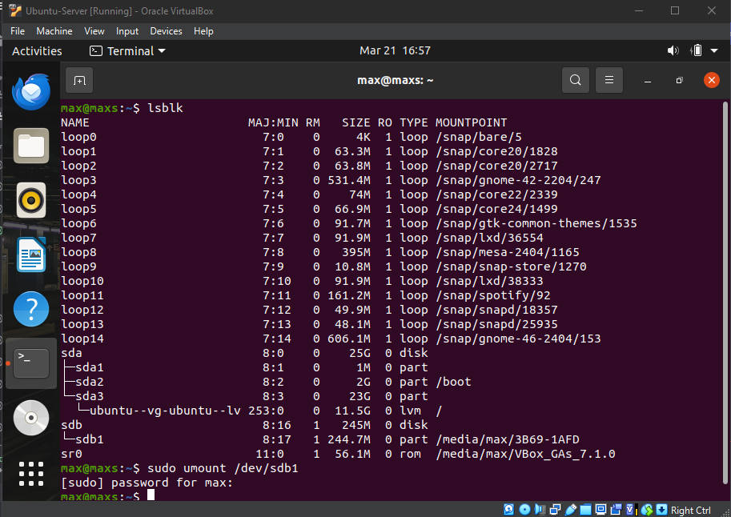
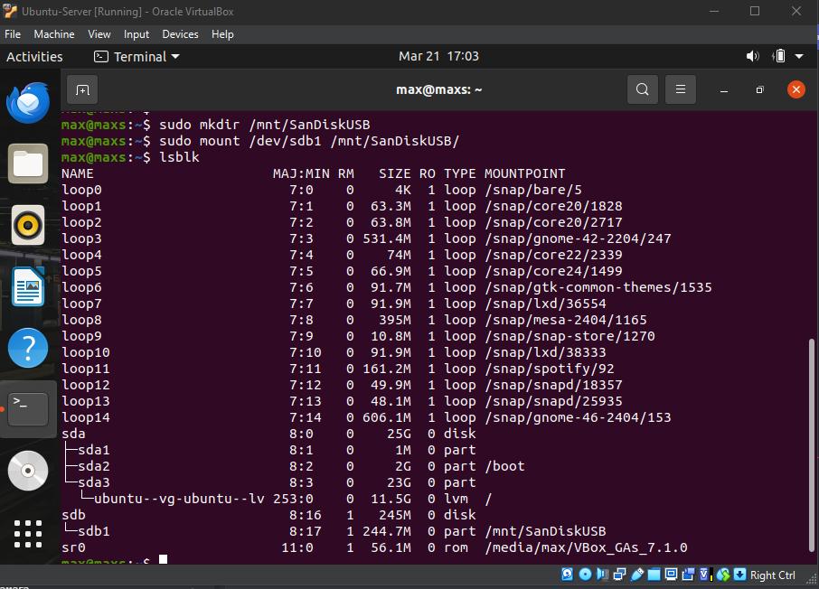
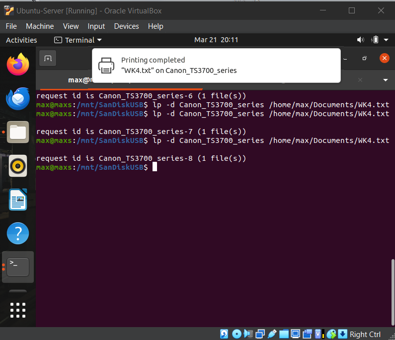
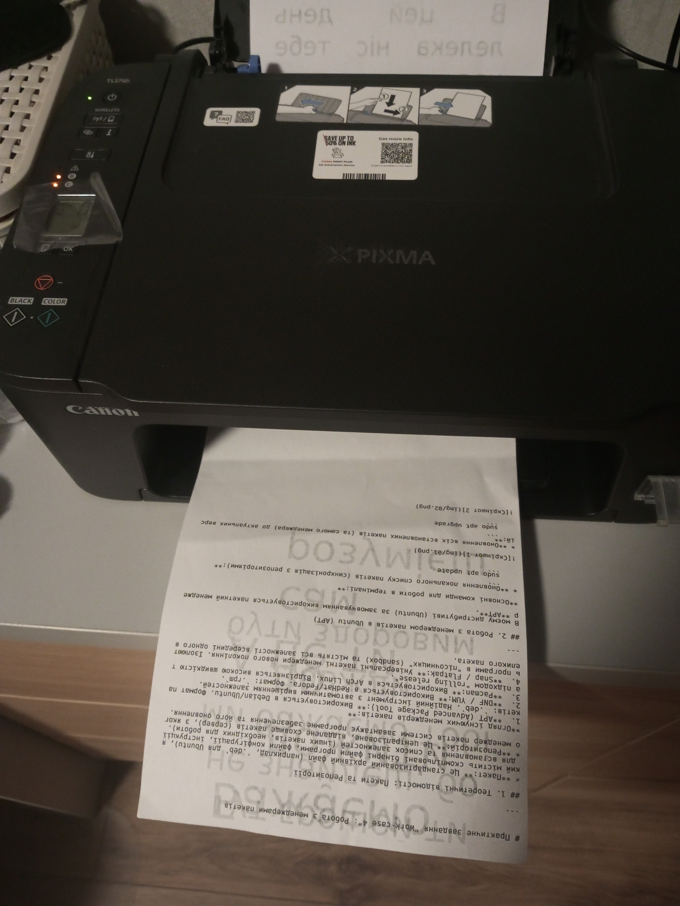
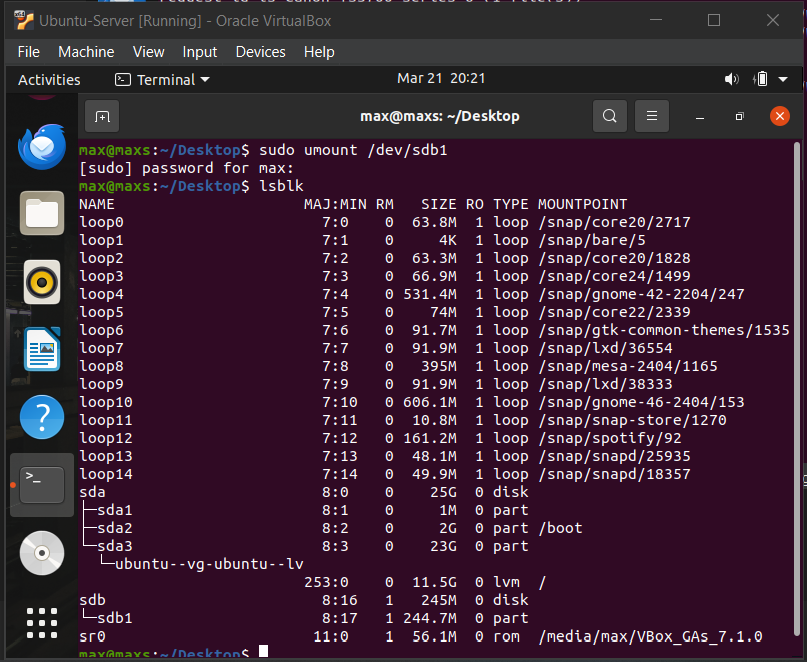

# Звіт з виконання практичного завдання "Work-case 5"

## 1. Теоретична частина

### 1.1. Механізми роботи з периферією в Linux
У Linux робота з обладнанням базується на принципі **"Everything is a file"**.
- **Флеш-накопичувачі:** Обробляються як блочні пристрої (`/dev/sdX`). Взаємодія відбувається через підсистему ядра та демона `udev`.
- **Принтери:** Використовують систему **CUPS**, яка керує чергами друку та драйверами, представляючи принтер як вузол у файловій системі.

### 1.2. Операція монтування
**Монтування** - це процес підключення файлової системи зовнішнього пристрою до основного дерева каталогів ОС. Без монтування вміст пристрою залишається недоступним для користувача, навіть якщо фізичне з'єднання встановлено.
*Команда для монтування:* `mount [пристрій] [точка_монтування]`

### 1.3. Порівняння Linux та Windows
| Функція | Linux | Windows |
| :--- | :--- | :--- |
| Доступ до дисків | Точки монтування (директорії) | Літери дисків (A-Z) |
| Конфігурація | Текстові файли в `/etc` | Реєстр та Диспетчер пристроїв |
| Драйвери | Переважно вбудовані в ядро | Часто потребують окремого встановлення |

---

## 2. Практична частина

### 2.1. Робота через графічний інтерфейс (GUI)
1. Підключено USB-накопичувач до віртуальної машини.

2. Файл скопійовано за допомогою стандартного провідника.

3. Виконано друк файлу.

### 2.2. Робота через термінал (CLI)
1. `lsblk` - ідентифікація пристрою.
2. `sudo umount /dev/sdb1` - розмонтування автоматичного монтування.

3. `sudo mkdir /mnt/SanDiskUSB - створення місце для монтування.
4. `sudo mount /dev/sdb1 /mnt` - ручне  монтування.
5.. `lsblk` - перевірка успішності виконання монтування. 

6. `cp /mnt/t/SanDiskUSB/WK4.txt  /home/max/Documents/` - копіювання.
7. `lp -d Canon_TS3700_series /home/max/Documents/WK4.txt` - друк.

8. `sudo umount /dev/sdb1` - безпечне вилучення.

---
