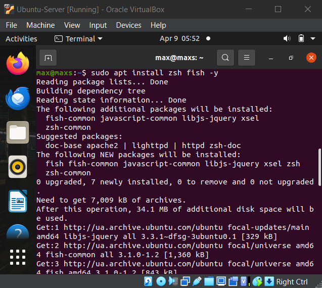
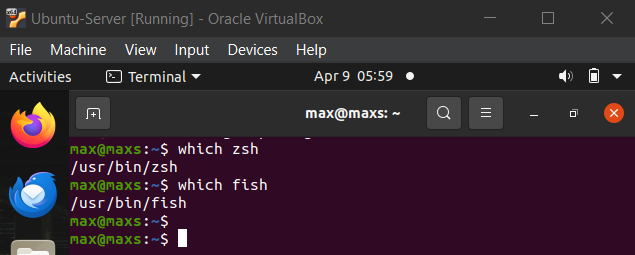
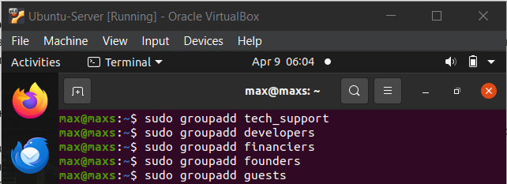
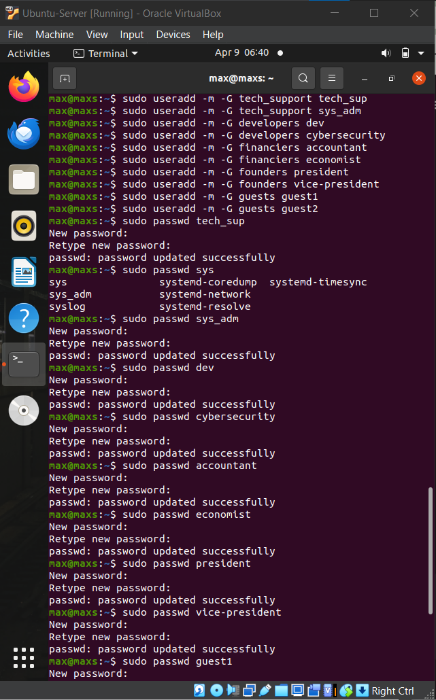
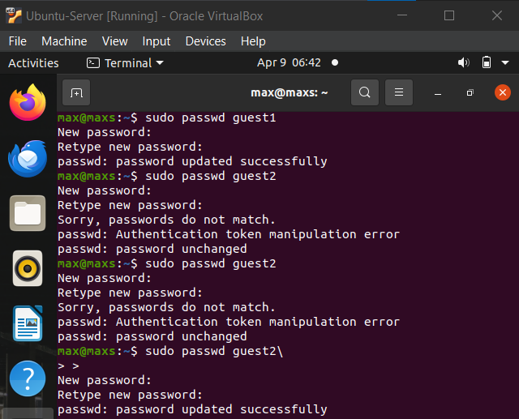
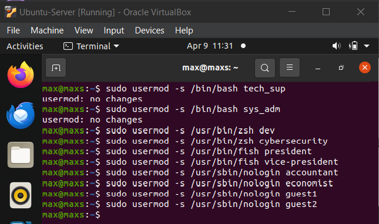
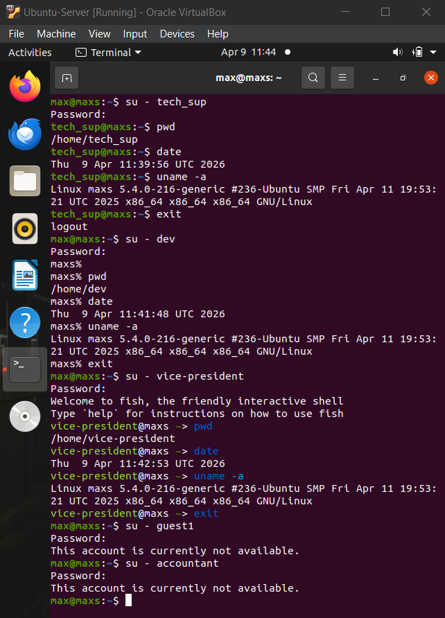

 # Work Case №6

## 1. Встановлення командних інтерпретаторів

### Візьмемо 2 додаткових shell:
- `fish`
- `zsh`

```Bash
sudo pacman -S fish zsh
```

### Перевірка встановлених shell

```Bash
cat /etc/shells
```



#### Короткий опис

| bash | fish | zsh |
| :--- | :--- | :--- |
| Стандартний shell у Linux | Дуже зручний і сучасний shell | Розширена версія bash |
| Підтримка скриптів | Підсвітка синтаксису | Автодоповнення (smart completion) |
| Сумісність майже з усіма системами | Автопідказки прямо під час введення | Підтримка тем (oh-my-zsh) |
| Використовується адміністраторами | Не повністю сумісний з bash-скриптами | Зручний для розробників |

---

## 2. Створення користувачів і груп

### Створення груп

```Bash
sudo groupadd tech_support
sudo groupadd developers
sudo groupadd financiers
sudo groupadd founders
sudo groupadd guests
```


### Створення користувачів

#### Technical support (bash)

```Bash
sudo useradd -m -G tech_support -s /bin/bash tech1
sudo useradd -m -G tech_support -s /bin/bash tech2
```

#### Developers (fish)

```Bash
sudo useradd -m -G developers -s /bin/fish dev1
sudo useradd -m -G developers -s /bin/fish dev2
```

#### Financiers (без shell)

```Bash
sudo useradd -m -G financiers -s /usr/bin/nologin fin1
sudo useradd -m -G financiers -s /usr/bin/nologin fin2
```

#### Founders (zsh)

```Bash
sudo useradd -m -G founders -s /bin/zsh founder1
sudo useradd -m -G founders -s /bin/zsh founder2
```

#### Guests (без shell)

```Bash
sudo useradd -m -G guests -s /usr/bin/nologin guest1
sudo useradd -m -G guests -s /usr/bin/nologin guest2
```



---

## 3. Таблиця призначення shell за замовчуванням

| Група | Shell |
| :--- | :--- |
| Technical support | `/bin/bash` |
| Developers | `/bin/fish` |
| Financiers | `/usr/bin/nologin` |
| Founders | `/bin/zsh` |
| Guests | `/usr/bin/nologin` |

### Перевірка створених груп та користувачів в них 

```Bash
cat /etc/group
```


---

## 4. Приклади роботи користувачів

### Перехід до користувача

```Bash
su - founder1
```



### Приклади команд з кожним командним інтерпретатором

#### Інформація про систему

```Bash
uname -a
```

#### Поточна дата

```Bash
date
```

#### Поточний каталог

```Bash
pwd
```

#### Вміст каталогу

```Bash
ls -la
```

#### Інформація про користувача

```Bash
whoami
```



### Перевірка заборони shell користувачам груп Financiers та Guests

```Bash
su - fin1
```

```Bash
su - guest1
```



---

## Словник (Vocabulary)

1. Account — record in the operating system that allows a user to log in and access system resources.

2. Bash (Bourne Again Shell) — widely used command-line interpreter in Linux systems that supports scripting and automation.

3. Default Shell — command interpreter that starts automatically when a user logs into the system.

4. Fish (Friendly Interactive Shell) — modern command-line shell known for user-friendly features like syntax highlighting and autosuggestions.

5. Zsh (Z Shell) — advanced shell that extends Bash with additional features like improved tab completion and customization.

6. Nologin — special shell (`/usr/bin/nologin`) that prevents users from logging into the system.

7. Permissions — rules that define how users can access files and system resources.

8. User — individual account that can log into and interact with the operating system.

9. User Group — set of users categorized together to simplify permission management.

10. Root User — administrative user with full access to all system resources and commands.

---

## Висновок (Conclusion)

In this work, different command-line interpreters in a Linux operating system were installed and explored, demonstrating how the system can support multiple shells with distinct features and capabilities. Each interpreter provides its own advantages, allowing users to choose the most suitable environment for their tasks. Additionally, user management was implemented by creating multiple users and organizing them into groups according to their roles, which reflects a real-world approach to system administration. Default shells were assigned based on group responsibilities, including restricting access for certain categories of users, highlighting the importance of security and access control in Linux systems. Practical examples of working within different shells confirmed that each group can efficiently perform tasks relevant to their needs, while the system maintains flexibility, structure, and controlled access.

---

## Team Contributions
- **Member 1 ([Shanson777])**: Created text for almost full report, did consulation
- **Member 2 ([Pisk08])**:  Did technical part of work and took screenshots
- **Member 3 ([Vangus387474])**:  Registered full text of report and did theoretical tasks
