# Work Case №8

## 1. Що можна робити в терміналі (заміна GUI)

### Файловий менеджер у терміналі
- `mc` (Midnight Commander) — найпопулярніший
- `ranger` — більш сучасний, з прев’ю

#### Встановлення

```Bash
sudo apt install mc
```

#### Запуск

```Bash
mc
```

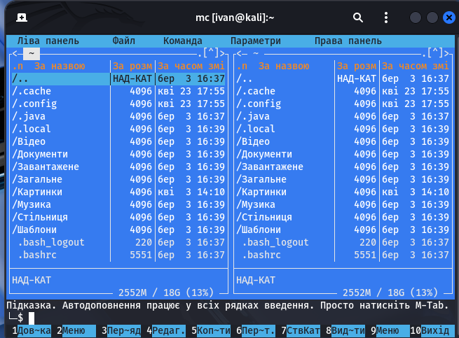

### Веб-браузер у терміналі
- `lynx` (простий)
- `w3m` (підтримує картинки)
- `links`

#### Встановлення

```Bash
sudo apt install lynx
```

#### Запуск

```Bash
lynx google.com
```

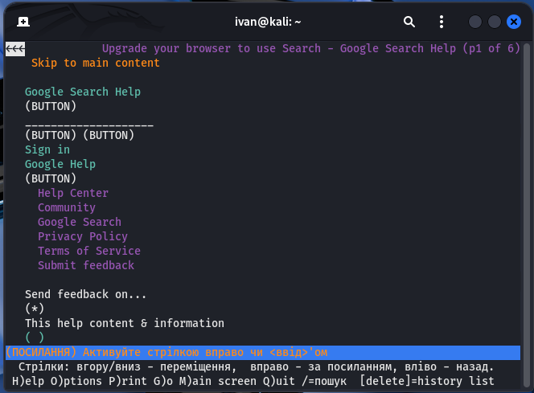

### Пошта в терміналі
- `mutt` (класика)
- `neomutt` (покращена версія)


#### Встановлення

```Bash
sudo apt install neomutt
```

#### Запуск

```Bash
neomutt
```

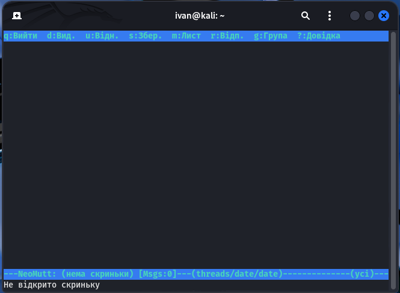

Потрібно налаштувати SMTP/IMAP (наприклад Gmail)

### Музика в терміналі
- `ncmpcpp` + `mpd`(дуже популярна зв’язка)

#### Встановлення

```Bash
sudo apt install ncmpcpp
```

#### Запуск

```Bash
ncmpcpp
```

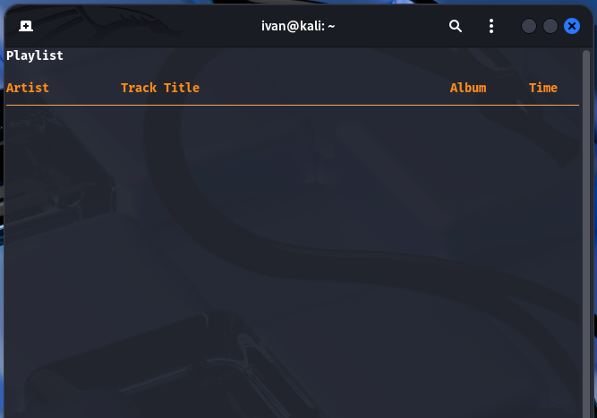

### Торенти через термінал
- `transmission-cli`
- `rtorrent`


#### Встановлення

```Bash
sudo apt install transmission-cli
```

#### Запуск

```Bash
transmission-cli file.torrent
```

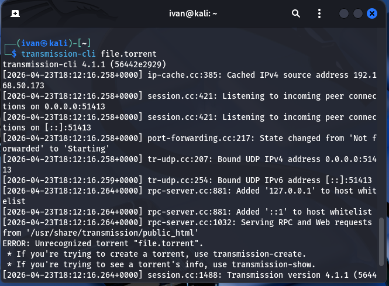

### Календар і нагадування
- `calcurse` — простий і зручний


#### Встановлення

```Bash
sudo apt install calcurse
```

#### Запуск

```Bash
calcurse
```

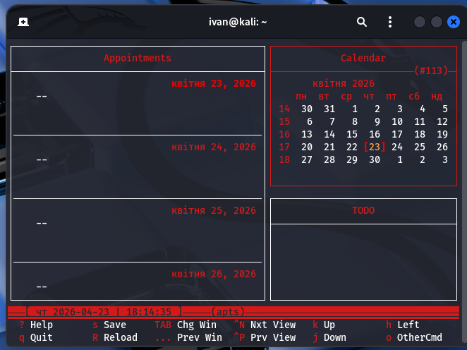

### Перегляд зображень у терміналі
- `feh` (потребує X, але легкий)
- `fim` (чистий tty)
- `viu` (ASCII/Unicode рендеринг)
- `chafa`

#### Встановлення

```Bash
sudo apt install chafa
```

#### Запуск

```Bash
chafa /media/sf_Pictures/IMG_3581.jpg
```

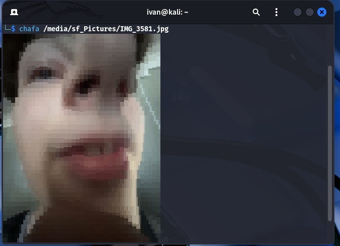

---

## 2. Класичні інструменти адміністратора

### Редактори тексту
- `nano` — простий
- `vim` — потужний
- `neovim` — сучасний vim

#### Встановлення

```Bash
sudo apt install nano vim neovim
```

#### Приклад

```Bash
nano file.txt
vim file.txt
```

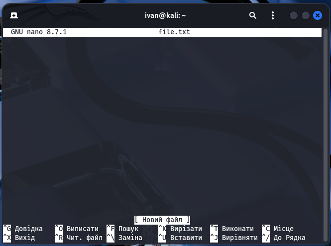

### Моніторинг системи
- `htop` — найзручніший
- `btop` — красивий (новий)
- `top` — стандартний

#### Встановлення:

```Bash
sudo apt install htop
```

#### Запуск

```Bash
htop
```

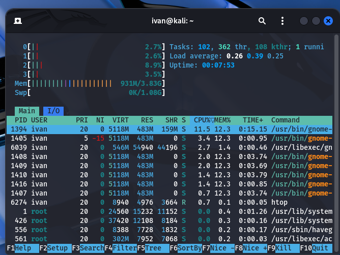

---

## 3. Пасхалки

### Паровозик

#### Встановлення:

```Bash
sudo apt install sl
```

#### Запуск

```Bash
sl
```

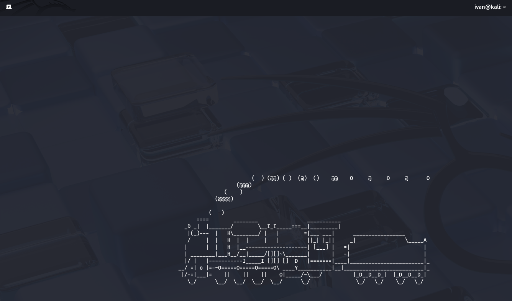

### Star Wars у терміналі

#### Встановлення:

```Bash
sudo apt install telnet
```

#### Запуск

```Bash
telnet telehack.com
```


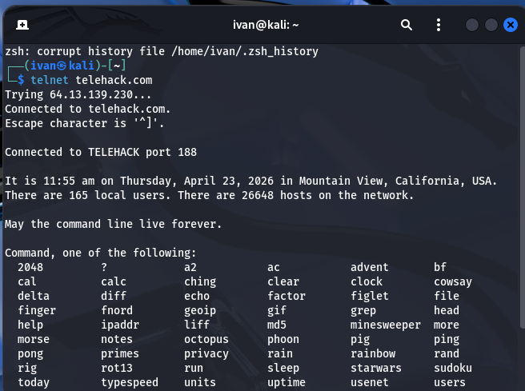

```Bash
starwars
```
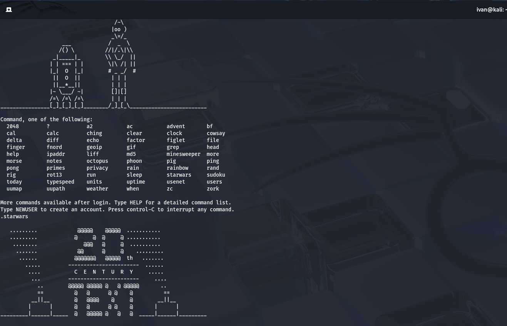
### Розмова з коровою

#### Встановлення:

```Bash
sudo apt install cowsay
```


#### Запуск

```Bash
cowsay You ain't nothing but a hound dog
```

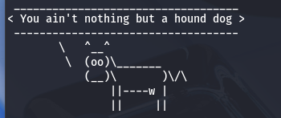

---
1. Terminal — text-based interface used to interact with the operating system by entering commands.

2. Command Line Interface (CLI) — method of interacting with a computer system using typed commands instead of a graphical interface.

3. File Manager (Terminal-based) — text-based application used to browse and manage files and directories (`Midnight Commander`).

4. Text-based Web Browser — browser that allows users to access websites within the terminal (`lynx`, `w3m`).

5. Email Client (CLI) — terminal-based program used to read, send, and manage emails (`mutt`, `neomutt`).

6. Media Player (CLI) — command-line application used to play audio files (`ncmpcpp`, `mpd`).

7. MPD (Music Player Daemon) — background service that manages music playback and is controlled by clients like ncmpcpp.

8. Torrent Client (CLI) — terminal-based application used to download files via the BitTorrent protocol (`transmission-cli`, `rtorrent`).

9. Calendar Application (CLI) — terminal-based program used for scheduling events and reminders (`calcurse`).

10. Image Viewer (CLI) — program that allows viewing images directly in the terminal (`fim`, `viu`, `chafa`).

---

## Висновок (Conclusion)


## Team Contributions
- **Member 1 ([Shanson777])**: Created text for almost full report, did consulation
- **Member 2 ([Pisk08])**:  Registered full text of report and did theoretical tasks
- **Member 3 ([Vangus387474])**:  Did technical part of work and took screenshots


