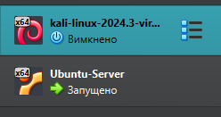
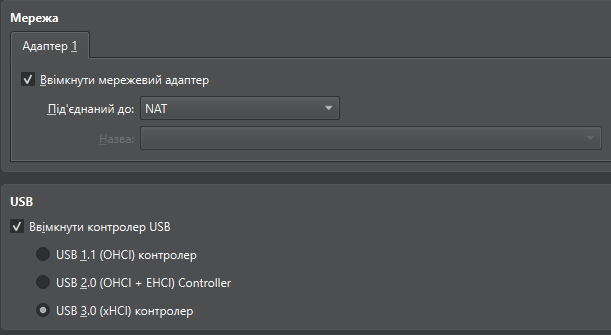
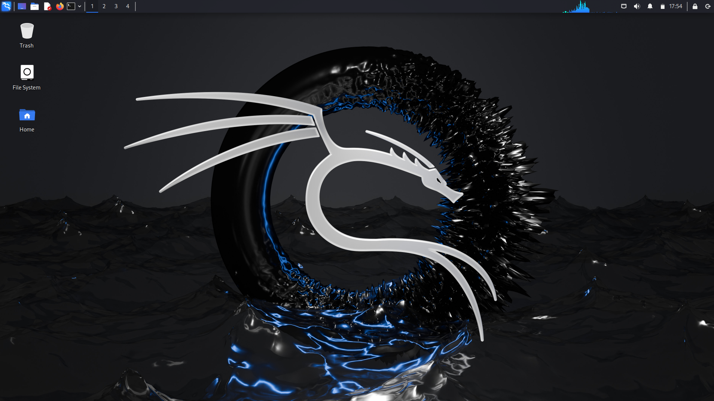
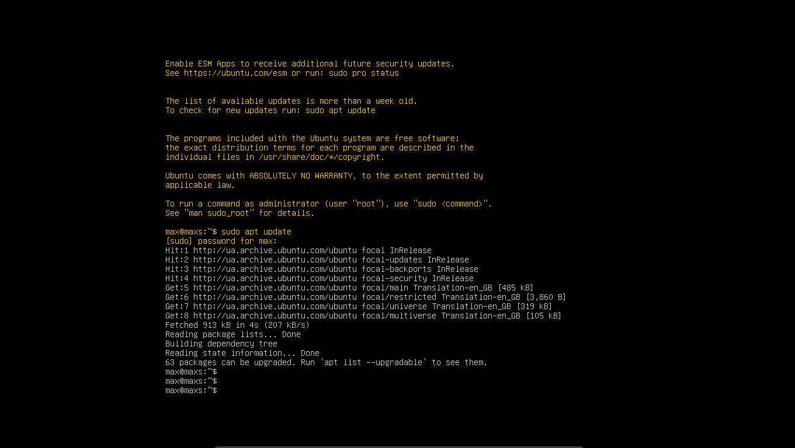
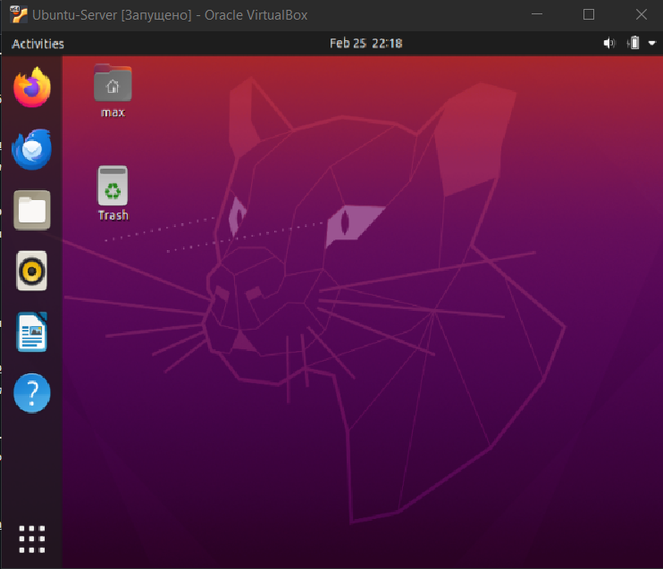
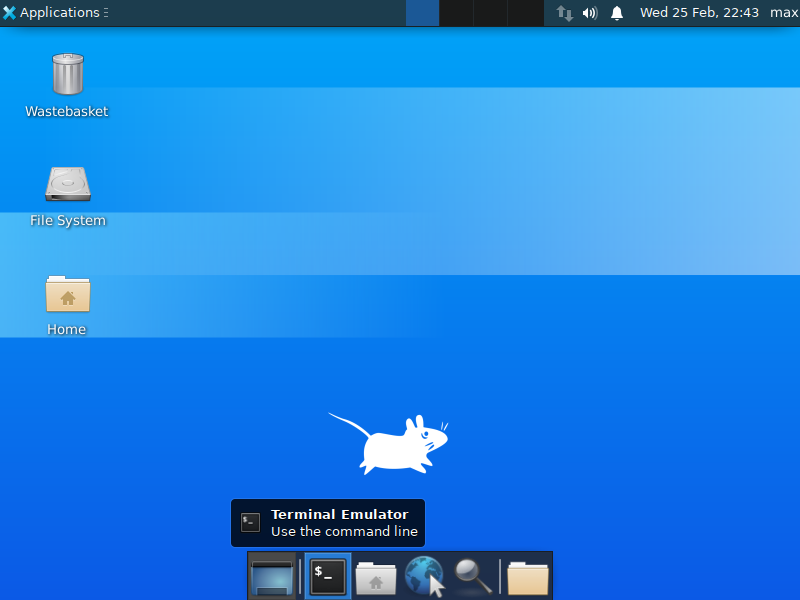

# Workcase 2

## Мета роботи: Ознайомитися з роботою гіпервізора ІІ типу, навчитися створювати віртуальні машини, керувати віртуальним обладнанням, а також встановлювати ОС GNU/Linux у різних конфігураціях (графічній та термінальній) із подальшим налаштуванням графічних оболонок.

## Виконали: Піскун М.О., Божок Т.Ю., Гусєв І.Ю.

## Glossary

| Український термін | Англійський термін | Абревіатура / Примітка |
| :--- | :--- | :--- |
| **Гіпервізор ІІ типу** | Type-2 Hypervisor / Hosted Hypervisor | Працює поверх основної операційної системи. |
| **Віртуальна машина** | Virtual Machine | **VM** |
| **Хост-система** | Host Operating System | Основна ОС, встановлена на фізичному комп'ютері. |
| **Гостьова система** | Guest Operating System | ОС, встановлена всередині віртуальної машини. |
| **Оперативна пам'ять** | Random Access Memory | **RAM** |
| **Віртуальний жорсткий диск** | Virtual Hard Disk / Disk Image | **VDI**, **VHD**, **VMDK** (популярні формати). |
| **Мережевий міст** | Bridged Adapter / Bridged Networking | Тип мережевого підключення для отримання окремої IP-адреси від роутера. |
| **Трансляція мережевих адрес**| Network Address Translation | **NAT** (ВМ використовує IP-адресу хоста для доступу в інтернет). |
| **Графічна оболонка** | Desktop Environment | **DE** (наприклад, GNOME, XFCE). |
| **Графічний інтерфейс** | Graphical User Interface | **GUI** |
| **Командний рядок / Термінал**| Command Line Interface | **CLI** / Terminal / Shell. |
| **Дистрибутив Linux** | Linux Distribution | **Distro** (наприклад, Ubuntu, Debian). |
| **Менеджер пакетів** | Package Manager | Утиліта для встановлення ПЗ (наприклад, `apt`). |
| **Прокидання USB / Флешка** | USB Passthrough / USB Flash Drive | Процес підключення фізичного USB-пристрою до ВМ. |
| **Образ диска** | ISO Image | Файл у форматі `.iso`, який використовується як віртуальний CD/DVD для встановлення ОС. |

## 1. Базові дії в гіпервізорі (VirtualBox)

Для виконання роботи було обрано гіпервізор Oracle VM VirtualBox.

* **Створення нової віртуальної машини:** Виконується через кнопку «Створити» (New). Під час створення задається ім'я ВМ, тип ОС, обсяг виділеної оперативної пам'яті та створюється віртуальний жорсткий диск (VDI).
* **Вибір/додавання обладнання:** Здійснюється в меню «Налаштування» (Settings). У розділі «Система» можна змінювати кількість процесорних ядер і ОЗП. У розділі «Носії» (Storage) підключаються ISO-образи дистрибутивів.
* **Налаштування мережі:** Для підключення до Wi-Fi хоста використовується тип підключення «Мережевий міст» (Bridged Adapter) з вибором бездротового адаптера ПК. Це дозволяє ВМ отримувати власну IP-адресу від локального роутера.
* **Робота із зовнішніми носіями:** Щоб підключити USB-флешку, в налаштуваннях ВМ у розділі «USB» додається фільтр для відповідного пристрою. Після запуску ВМ флешка монтується як фізичний накопичувач у гостьовій системі.

### *Рис. 1. Головне вікно гіпервізора VirtualBox зі створеними віртуальними машинами.*

### *Рис. 2. Налаштування мережевого адаптера (або прокидання USB) для віртуальної машини.*

## 2. Встановлення ОС з графічною оболонкою (Перша ВМ)

Було створено першу віртуальну машину зі встановленою ОС **Kali Linux**. 

### *Рис. 3. Робочий стіл першої ВМ зі встановленою Ubuntu Desktop.*

## 3. Робота з термінальною ОС та встановлення графічних оболонок (Друга ВМ)

Для другої віртуальної машини було обрано образ **Ubuntu Server**, який встановлюється виключно з інтерфейсом командного рядка (CLI).

### *Рис. 4. Інтерфейс командного рядка після базового встановлення ОС без графічної оболонки.*

### 3.1 Встановлення GNOME поверх термінальної версії
Після базового налаштування мінімальної системи, за допомогою менеджера пакетів `apt` було встановлено графічну оболонку GNOME командами:
`sudo apt update`
`sudo apt install ubuntu-desktop`
Після перезавантаження система успішно запустилася з графічним інтерфейсом.

### *Рис. 5. Графічна оболонка GNOME, встановлена поверх термінальної версії ОС.*

### 3.2 Встановлення додаткової графічної оболонки (XFCE)
Для порівняння було встановлено легковагове графічне середовище XFCE за допомогою команди:
`sudo apt install xfce4`

### *Рис. 6. Робочий стіл альтернативної графічної оболонки XFCE.*

### 3.3 Порівняння GNOME та XFCE

| Характеристика | GNOME | XFCE |
| :--- | :--- | :--- |
| **Споживання ресурсів** | Високе (потребує більше оперативної пам'яті та ресурсів CPU) | Низьке (оптимізовано для слабких машин) |
| **Інтерфейс та парадигма** | Сучасний, орієнтований на повноекранні меню та робочі простори | Класичний десктопний (панель задач, меню "Пуск") |
| **Кастомізація** | Здійснюється переважно через сторонні розширення (GNOME Extensions) | Високий ступінь налаштування "з коробки" (панелі, віджети) |
| **Швидкодія у ВМ** | Може мати затримки без 3D-прискорення | Працює дуже швидко та плавно |

## **Conclusion:** GNOME offers a modern and visually appealing interface but is highly resource-intensive. On the other hand, XFCE serves as an excellent alternative for virtual machines or legacy hardware, as it ensures fast, smooth performance while maintaining a classic and intuitive desktop design.
